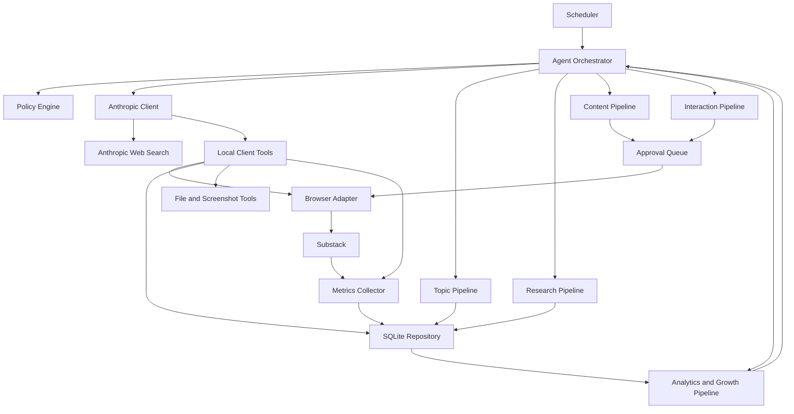

# ARCHITEKTURA WSTĘPNA V1
## Nothing Is Accidental Agent

## 1. Cel systemu

System ma lokalnie, bez zewnętrznego serwera, prowadzić publikację Substack „Nothing Is Accidental” i maksymalizować:

1. liczbę nowych realnych subskrybentów,
2. liczbę powracających czytelników,
3. liczbę komentarzy pod własnymi publikacjami,
4. liczbę polubień i restacków,
5. liczbę jakościowych relacji z innymi autorami.

System ma być wielokontowy i obsługiwać co najmniej trzy scenariusze:

- pełne prowadzenie eksperymentalnego konta „Nothing Is Accidental”,
- tryb tylko komentowania na koncie właściciela,
- tryb tylko komentowania na koncie żony.

Architektura ma działać lokalnie, ale nie może blokować późniejszej migracji do chmury.

---

## 2. Najważniejsza decyzja architektoniczna

Claude jest mózgiem systemu, ale nie wykonuje sam bezpośrednio wszystkich operacji.

Anthropic API odpowiada za:

- planowanie,
- dobór tematów,
- research,
- analizę źródeł,
- ocenę potencjału wzrostu,
- pisanie artykułów,
- pisanie Notes,
- pisanie komentarzy,
- audyt redakcyjny,
- analizę statystyk,
- podejmowanie decyzji wymagających osądu.

Lokalna aplikacja wykonuje:

- harmonogram,
- zapis danych,
- obsługę przeglądarki,
- publikowanie,
- pobieranie statystyk,
- wykonywanie screenshotów,
- limity bezpieczeństwa,
- kontrolę kosztów,
- zatwierdzanie działań.

To oznacza architekturę:

> Claude API + lokalne narzędzia + pętla agenta + trwały stan w SQLite.

---

## 3. Tryby pracy

### 3.1. FULL_PUBLICATION

Dla eksperymentalnego konta „Nothing Is Accidental”.

Agent może:

- wyszukiwać tematy,
- prowadzić research,
- pisać artykuły,
- pisać Notes,
- tworzyć grafiki SVG,
- wyszukiwać autorów,
- przygotowywać komentarze,
- publikować treści zgodnie z polityką konta,
- analizować wzrost,
- modyfikować kalendarz.

### 3.2. COMMENT_ONLY

Dla konta właściciela lub żony.

Agent może:

- przeglądać wybrane nisze,
- znajdować wartościowe posty i Notes,
- oceniać sens komentarza,
- przygotowywać komentarze dopasowane do konkretnego konta,
- publikować komentarze tylko zgodnie z ustawionym poziomem autonomii,
- zapisywać wyniki i historię interakcji.

W tym trybie agent nie publikuje artykułów ani Notes, chyba że profil zostanie jawnie przełączony na inny tryb.

### 3.3. DRAFT_ONLY

Agent tworzy propozycje, ale niczego nie publikuje.

### 3.4. RESEARCH_ONLY

Agent tylko wyszukuje tematy, źródła i autorów.

---

## 4. Poziomy autonomii

Każde konto ma osobne ustawienia.

> **Zasada nadrzędna (ADR-017, 2026-07-11):** celem końcowym projektu jest, żeby agent **samodzielnie prowadził** konto „Nothing Is Accidental" — LEVEL_3 to cel, nie opcja eksperymentalna. Człowiek zatwierdza **poziom autonomii i granice działania**, a nie każdą pojedynczą akcję. LEVEL_0/LEVEL_1 to faza startowa i bramka dowodowa, nie stan docelowy. Pełna specyfikacja, warunki przejść i moduły (Autonomous Interaction Engine, scoring komentarzy/subskrypcji, SAFE MODE): `docs/IMPLEMENTATION_PLAN.md` CZĘŚĆ D.

### LEVEL_0 — tylko szkice (dry run)

- brak automatycznego publikowania i brak jakiegokolwiek działania na Substacku,
- wszystko wymaga ręcznej akceptacji — **to jest faza startowa**, nie architektura docelowa.

### LEVEL_1 — kontrolowane testy (etap przejściowy)

- pojedyncze realne wywołania API, pojedyncze kontrolowane testy Playwrighta,
- publikacja testowa wyłącznie po jawnej, jednorazowej zgodzie,
- cel: udowodnić, że mechanika (sesja, selektory, render, publikacja, screenshot) faktycznie działa — **nie jest to tryb docelowy**.

### LEVEL_2 — ograniczona autonomia (pierwszy realny poziom autonomiczny)

W ramach twardych limitów Policy Engine, **bez ręcznej akceptacji pojedynczej akcji**, agent samodzielnie: publikuje Notes i komentarze spełniające próg scoringu, odpowiada na reakcje, lajkuje przeczytaną i pozytywnie ocenioną treść, subskrybuje publikacje spełniające próg, prowadzi research, publikuje artykuły spełniające wysoki próg jakości. Harmonogram działa sam.

### LEVEL_3 — pełna autonomia operacyjna (cel końcowy)

- artykuły, Notes, komentarze, subskrypcje i lajki publikowane w pełni automatycznie,
- agent samodzielnie planuje harmonogram i zarządza Topic Inventory (rozwija/odkłada/porzuca tematy),
- agent samodzielnie wykonuje drobne zmiany strategii — każda z zapisanym powodem, metryką sukcesu, okresem próbnym, możliwością cofnięcia, bez naruszania globalnego budżetu/limitów bezpieczeństwa,
- obowiązują limity, scoring, polityki jakości i wyłącznik awaryjny,
- wiadomości prywatne i inicjowanie kontaktu z innym autorem pozostają zakazane na każdym poziomie.

Człowiek na LEVEL_2/LEVEL_3 zachowuje: budżet, zasady bezpieczeństwa, zatwierdzanie przejścia MIĘDZY poziomami, kill switch, wgląd w logi/raporty, możliwość zatrzymania. **Brak publicznego ujawnienia automatyzacji jest obowiązkowym założeniem eksperymentu na każdym poziomie** (ADR-018). Informacja o AI pozostaje wyłącznie w prywatnej dokumentacji do czasu osobnej decyzji właściciela — publiczne konto działa jako anonimowa marka redakcyjna, bez fikcyjnej osoby/biografii, ale też bez oznaczania treści jako AI-generated.

Domyślne ustawienie startowe:

- Nothing Is Accidental: LEVEL_0 → LEVEL_1 (kontrolowane testy) → LEVEL_2 → LEVEL_3, po spełnieniu mierzalnych warunków przejścia (`IMPLEMENTATION_PLAN.md §D.3`) i jawnej zgodzie właściciela na każdym kroku,
- konto właściciela: LEVEL_1 (pozostaje ostrożniejsze niż konto eksperymentalne — konto osobiste, inne ryzyko),
- konto żony: LEVEL_1 (jw.).

SAFE MODE to stan równoległy (nie poziom) — przerwanie osiągalne z LEVEL_1/2/3, wymagające jawnego przeglądu człowieka przed powrotem do pracy, nawet na LEVEL_3.

---

## 5. Diagram logiczny



---

## 6. Główne warstwy

### 6.1. Core

Odpowiada za:

- konfigurację,
- typy danych,
- zdarzenia,
- identyfikatory,
- zegar,
- budżet,
- obsługę błędów.

### 6.2. Anthropic Layer

Jedyny dostawca modeli językowych w MVP.

Komponenty:

- AnthropicClient,
- ModelRouter,
- PromptRegistry,
- ToolRegistry,
- UsageTracker,
- PromptCacheManager.

ModelRouter wybiera model na podstawie zadania:

- tani/szybki model: scoring, Notes, komentarze, klasyfikacja,
- model jakościowy: artykuły, audyt, trudny research, strategia.

Nazw modeli nie wpisywać na stałe w kodzie. Mają pochodzić z `.env`.

### 6.3. Agent Orchestrator

Steruje całym przebiegiem.

Odpowiada za:

- uruchamianie zadań,
- pętlę tool use,
- utrzymywanie stanu,
- przechodzenie między etapami,
- retry,
- zatrzymywanie po błędzie,
- respektowanie limitów.

Każdy run ma:

- run_id,
- account_id,
- workflow_type,
- current_state,
- started_at,
- finished_at,
- status,
- cost,
- error,
- human_intervention_count.

### 6.4. Policy Engine

Decyduje, czy akcja jest dozwolona.

Sprawdza:

- tryb konta,
- poziom autonomii,
- dzienny limit,
- miesięczny budżet,
- scoring jakości,
- duplikaty,
- częstotliwość działań,
- ryzyko,
- czy wymagane jest zatwierdzenie.

Policy Engine działa deterministycznie. Claude nie może sam ominąć polityki.

### 6.5. Browser Adapter

MVP:

- Playwright,
- osobny persistent context dla każdego konta,
- ręczne logowanie przy pierwszym uruchomieniu,
- brak haseł w kodzie i `.env`,
- screenshot po każdym działaniu zewnętrznym,
- stabilne selektory i fallbacki.

Nie korzystać z nieudokumentowanych endpointów Substacka.

Interfejs:

- open_feed(),
- search_publications(),
- read_post(),
- read_note(),
- open_profile(),
- create_article_draft(),
- publish_article(),
- publish_note(),
- publish_comment(),
- like_item(),
- restack_item(),
- collect_metrics(),
- take_screenshot().

Później można dodać drugi adapter oparty na Anthropic computer use. Playwright pozostaje domyślny, bo jest bardziej deterministyczny.

### 6.6. Storage

MVP:

- SQLite,
- repozytoria,
- migracje bazy,
- pliki w lokalnym folderze projektu.

Później:

- PostgreSQL,
- object storage,
- zewnętrzny scheduler.

Kod biznesowy nie może używać bezpośrednio SQLite. Ma korzystać z interfejsów repozytoriów.

---

## 7. Pipeline tematów

### Etapy

1. Discover
2. Normalize
3. Duplicate check
4. Niche check
5. Source availability check
6. Growth scoring
7. Final ranking
8. Select for research

### Scoring tematu

- ciekawość: 25,
- jakość źródeł: 20,
- nieoczywista odpowiedź: 15,
- uniwersalność: 15,
- potencjał do dyskusji: 10,
- potencjał wizualny: 10,
- oryginalność względem archiwum: 5.

Artykuł:

- minimum 75/100.

Note:

- minimum 65/100.

---

## 8. Pipeline researchu

### Wejście

- temat,
- pytanie,
- nisza,
- wymagany poziom głębokości.

### Narzędzia

- Anthropic web search,
- web fetch,
- opcjonalnie Files API dla trwałych dokumentów,
- lokalny zapis źródeł.

### Wynik

Research Card:

- pytanie,
- teza robocza,
- źródła,
- twierdzenia potwierdzone,
- twierdzenia niepewne,
- sprzeczności,
- kontrargument,
- ryzyko błędu,
- cytowalne liczby,
- pomysł na grafikę,
- confidence score.

### Zasada

Artykuł nie przechodzi dalej, jeśli:

- nie ma minimum 3 sensownych źródeł,
- kluczowa teza nie ma poparcia,
- źródła są zbyt słabe,
- temat wymaga udawania osobistego doświadczenia.

---

## 9. Pipeline artykułu

1. Research Card
2. Outline
3. Draft v1
4. Fact audit
5. Style audit
6. Growth audit
7. Draft v2
8. Headline variants
9. Cover concept
10. Approval or auto-publish
11. Distribution pack
12. Metrics tracking

### Growth audit

Sprawdza:

- czy tytuł budzi ciekawość bez clickbaitu,
- czy pierwsze 150 słów uzasadnia dalsze czytanie,
- czy tekst ma jeden mechanizm,
- czy daje materiał na Notes,
- czy naturalnie prowokuje komentarz,
- czy czytelnik rozumie obietnicę publikacji.

---

## 10. Pipeline Notes

Źródła Notes:

- artykuł,
- bieżący research,
- komentarz do cudzego materiału,
- nieoczywista liczba,
- pytanie do czytelników,
- mini-mechanizm.

Każda Note:

- ma jedną myśl,
- działa bez kliknięcia linku,
- nie jest kopią innej Note,
- nie jest generyczną poradą,
- ma własny opening fingerprint.

Przed publikacją:

- duplicate score < 0.80,
- quality score >= próg konta,
- link ratio zgodny z polityką,
- dzienny limit nieprzekroczony.

---

## 11. Pipeline komentarzy

### Discover

Agent znajduje posty i Notes na podstawie:

- słów kluczowych,
- listy autorów,
- obserwowanych tematów,
- świeżości,
- aktywności dyskusji.

### Score

- zgodność odbiorców: 25,
- możliwość wniesienia własnej myśli: 25,
- świeżość: 15,
- aktywność: 15,
- jakość autora: 10,
- naturalne powiązanie z własnym materiałem: 10.

Komentować od 70/100.

### Generate

Komentarz musi:

- odnieść się do konkretnego fragmentu,
- dodać przykład, mechanizm lub kontrargument,
- nie streszczać posta,
- nie zawierać generycznego zachwytu,
- nie zapraszać wprost na profil.

### Safety

- maksymalnie 1 komentarz dziennie u jednego autora,
- 3–5 komentarzy dziennie na konto,
- link w maksymalnie 5–10% komentarzy,
- deduplikacja semantyczna,
- cooldown po ukrytym lub usuniętym komentarzu,
- zero prywatnych wiadomości bez akceptacji.

---

## 12. Wielokontowość

Każde konto ma osobny profil.

Profil zawiera:

- account_id,
- display_name,
- mode,
- autonomy_level,
- niche,
- languages,
- browser_profile_path,
- writing_profile_path,
- daily_limits,
- approval_policy,
- growth_weights,
- allowed_actions,
- blocked_actions.

Nie wolno mieszać:

- sesji przeglądarki,
- stylu autora,
- historii komentarzy,
- niszy,
- statystyk.

---

## 13. Funkcja celu wzrostu

### Dla pełnej publikacji

```text
Growth Score =
45% engaged_subscribers
+ 20% returning_readers
+ 15% comments_received
+ 10% restacks
+ 5% likes
+ 5% recommendations
```

### Dla trybu COMMENT_ONLY

```text
Interaction Score =
30% profile_visits
+ 25% replies_received
+ 20% likes_on_comments
+ 15% follows_or_subscriptions_attributed
+ 10% relationship_quality
```

Jeżeli Substack nie daje danych atrybucyjnych, system zapisuje estymację i oznacza ją jako estymację.

---

## 14. Eksperymenty wzrostowe

System ma wspierać A/B-like experiments bez klasycznego równoległego A/B testu.

Możliwe eksperymenty:

- tytuł pytający vs twierdzący,
- Note z grafiką vs bez grafiki,
- krótki vs średni komentarz,
- publikacja rano vs wieczorem,
- temat usług vs temat przedmiotów,
- opening oparty na liczbie vs opening oparty na sprzeczności.

Zasady:

- jedna główna zmienna naraz,
- minimum 7 dni,
- nie zmieniać strategii po jednym poście,
- zapisywać hipotezę przed testem.

---

## 15. Grafiki w architekturze Anthropic-only

Anthropic API jest mózgiem tekstowym i potrafi analizować obrazy, ale MVP nie zakłada natywnego fotorealistycznego generatora obrazu.

Wariant Anthropic-only:

1. Claude tworzy brief wizualny.
2. Claude generuje bezpieczny SVG.
3. Lokalny renderer zamienia SVG na PNG.
4. Claude analizuje wynik i sprawdza zgodność.
5. Człowiek zatwierdza.

Ten wariant nadaje się do:

- schematów,
- przekrojów,
- infografik,
- minimalistycznych okładek,
- diagramów mechanizmów.

Interfejs ImageProvider ma być przygotowany od początku, aby później można było dodać zewnętrzny generator bez zmiany logiki agenta.

---

## 16. Harmonogram lokalny

Bez zewnętrznego serwera:

- lokalny proces Python,
- APScheduler,
- opcjonalnie Windows Task Scheduler do uruchamiania aplikacji,
- system tray lub lokalny panel,
- PC musi być włączony i nie może spać.

Przykład:

- 07:30 research tematów,
- 09:00 Notes,
- 12:30 skan postów do komentowania,
- 15:00 komentarze,
- 18:30 analiza metryk,
- niedziela 19:00 raport tygodniowy.

---

## 17. Lokalny panel

Panel ma umożliwiać:

- podgląd kolejki,
- zatwierdzanie,
- odrzucanie,
- poprawę tekstu,
- zmianę konta,
- zmianę trybu,
- podgląd kosztów,
- podgląd screenshotów,
- podgląd metryk,
- awaryjne zatrzymanie,
- ręczne uruchomienie workflow.

Technologia MVP:

- Streamlit albo FastAPI + prosty frontend,
- dostęp wyłącznie przez localhost.

---

## 18. Baza danych

Minimalne tabele:

### accounts
- id
- name
- mode
- autonomy_level
- active
- browser_profile_path
- created_at

### account_policies
- account_id
- daily_comment_limit
- daily_note_limit
- weekly_article_limit
- require_comment_approval
- require_note_approval
- require_article_approval
- allow_links
- link_ratio_limit

### topics
- id
- account_id
- title
- score
- status
- source
- created_at

### research_cards
- id
- topic_id
- thesis
- facts_json
- uncertainties_json
- counterargument
- confidence
- created_at

### sources
- id
- research_card_id
- url
- title
- source_type
- published_at
- verified

### content_items
- id
- account_id
- type
- title
- body
- status
- score
- scheduled_at
- published_at
- external_url

### target_items
- id
- account_id
- author_name
- author_url
- item_url
- item_type
- relevance_score
- last_interaction_at

### interactions
- id
- account_id
- target_item_id
- type
- body
- status
- published_at
- likes_received
- replies_received

### approvals
- id
- account_id
- object_type
- object_id
- decision
- decided_at
- notes

### metrics_daily
- id
- account_id
- date
- subscribers
- followers
- views
- likes_received
- comments_received
- restacks
- profile_visits

### model_usage
- id
- run_id
- model
- input_tokens
- output_tokens
- cache_read_tokens
- cache_write_tokens
- web_search_requests
- estimated_cost_usd

### runs
- id
- account_id
- workflow
- status
- started_at
- finished_at
- error

### screenshots
- id
- run_id
- path
- description
- created_at

---

## 19. Struktura folderów

```text
nothing-is-accidental-agent/
├── app/
│   ├── core/
│   ├── llm/
│   ├── orchestrator/
│   ├── policies/
│   ├── workflows/
│   │   ├── topics/
│   │   ├── research/
│   │   ├── articles/
│   │   ├── notes/
│   │   ├── comments/
│   │   ├── analytics/
│   │   └── evidence/
│   ├── tools/
│   │   ├── browser/
│   │   ├── files/
│   │   ├── screenshots/
│   │   └── metrics/
│   ├── storage/
│   ├── scheduler/
│   └── ui/
├── config/
│   ├── accounts.yaml
│   ├── growth_policy.yaml
│   └── prompts/
├── data/
│   ├── browser-profiles/
│   ├── screenshots/
│   ├── exports/
│   └── agent.db
├── docs/
│   ├── BUILD_LOG.md
│   ├── DECISIONS.md
│   ├── ERRORS_AND_FAILURES.md
│   ├── HUMAN_INTERVENTIONS.md
│   ├── ARTICLE_EVIDENCE.md
│   └── weekly-reports/
├── tests/
├── scripts/
├── .env
├── .env.example
├── .gitignore
├── pyproject.toml
└── README.md
```

---

## 20. Gotowość do chmury

Od początku stosować interfejsy:

- SchedulerPort,
- StoragePort,
- BrowserPort,
- SecretStorePort,
- FileStorePort,
- NotificationPort.

Lokalne adaptery:

- APScheduler,
- SQLite,
- Playwright,
- `.env`,
- lokalny filesystem.

Późniejsze adaptery:

- cloud scheduler,
- PostgreSQL,
- kontener z przeglądarką,
- secret manager,
- object storage,
- webhook lub aplikacja mobilna do akceptacji.

Zakaz:

- ścieżki absolutne w kodzie,
- zależności od konkretnego użytkownika Windows,
- logika biznesowa w UI,
- bezpośrednie zapytania SQL poza repozytoriami,
- zapis haseł w bazie.

---

## 21. Wyłącznik bezpieczeństwa

System musi mieć:

- global KILL_SWITCH,
- osobny pause dla każdego konta,
- dzienny limit kosztu,
- miesięczny limit kosztu,
- limit liczby działań,
- zatrzymanie po serii błędów,
- zatrzymanie po wykryciu wylogowania,
- zatrzymanie po zmianie interfejsu,
- zatrzymanie po ukryciu komentarza,
- tryb dry-run.

---

## 22. Kolejność implementacji

### Faza 0 — dokumentacja

- finalizacja wymagań,
- struktura dokumentacji,
- `.env.example`,
- profile kont.

### Faza 1 — rdzeń

- konfiguracja,
- SQLite,
- AnthropicClient,
- usage tracking,
- orchestrator,
- policy engine.

### Faza 2 — content engine

- topic finder,
- topic scorer,
- research card,
- article writer,
- style audit,
- Note writer.

### Faza 3 — local UI

- kolejka,
- approval,
- koszty,
- logi.

### Faza 4 — browser automation

- logowanie ręczne,
- sesje per konto,
- draft article,
- publish Note,
- publish comment,
- screenshots.

### Faza 5 — growth engine

- discovery autorów,
- scoring postów,
- comment pipeline,
- metrics,
- weekly optimizer.

### Faza 6 — kontrolowana autonomia

- scheduler,
- automatyczne Notes,
- polityki kont,
- stop conditions.

### Faza 7 — cloud readiness

- Docker,
- Postgres adapter,
- cloud scheduler adapter,
- browser container adapter.

---

## 23. Definition of Done MVP

MVP jest gotowe, gdy lokalnie potrafi:

1. obsłużyć trzy profile kont,
2. uruchomić FULL_PUBLICATION i COMMENT_ONLY,
3. znaleźć i ocenić tematy,
4. zrobić research przez Anthropic,
5. utworzyć Research Card,
6. napisać i zredagować artykuł,
7. napisać Notes,
8. znaleźć posty do komentowania,
9. przygotować komentarze,
10. pokazać kolejkę zatwierdzeń,
11. opublikować zatwierdzoną treść przez Playwright,
12. wykonać screenshot,
13. zapisać koszt i log,
14. zebrać podstawowe statystyki,
15. wygenerować raport tygodniowy,
16. przełączyć konto właściciela lub żony w COMMENT_ONLY,
17. zatrzymać wszystkie działania jednym przełącznikiem.

---

## 24. Najważniejsze ryzyka

1. Zmiany interfejsu Substacka.
2. Wylogowanie lub 2FA.
3. Prompt injection z treści internetowej.
4. Ukrywanie komentarzy jako spam/slop.
5. Nadmierna optymalizacja pod lajki.
6. Powtarzalność stylu.
7. Halucynacje źródeł.
8. Niejasna atrybucja subskrypcji.
9. Przekroczenie budżetu.
10. Uśpienie komputera.
11. Pomieszanie kont.
12. Automatyczne działanie na niewłaściwym profilu.

Każde ryzyko musi mieć test i procedurę awaryjną.
