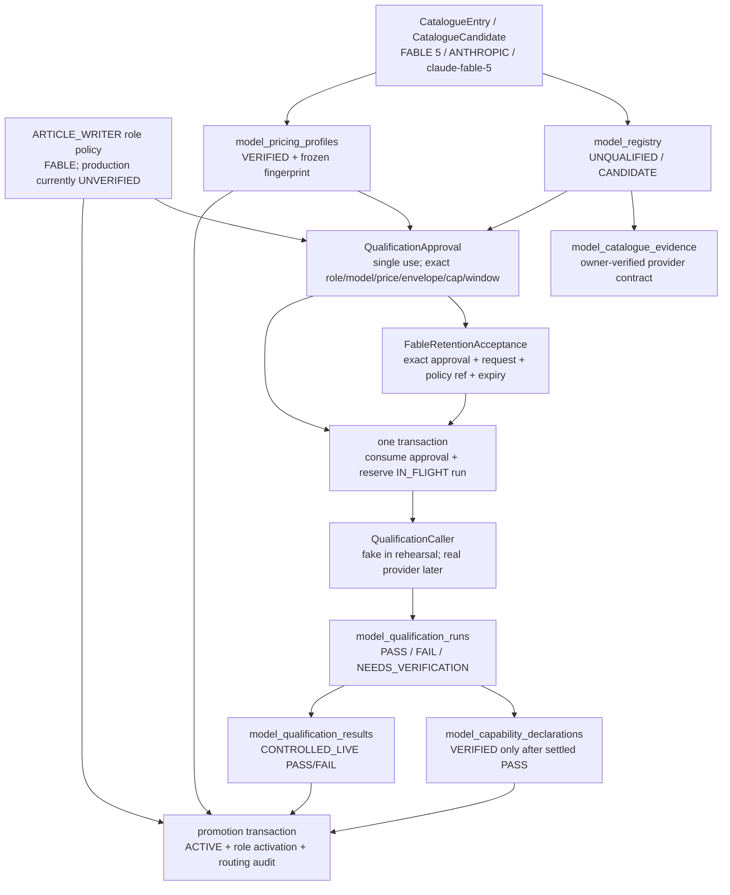

# Fable Qualification Authority Package — offline preparation

Data wykonania: 2026-08-10

Zakres: wyłącznie offline, repo + produkcja immutable + nowe temp DB

Etap roadmapy: Etap 3 (`IN PROGRESS`)

Authority commit: `11d5dbb92fb1d241a6ca4b5b91f0eed826796a8e`

> **STATUS (2026-08-10, po independent review): `CANDIDATE COMPLETE — AWAITING RE-REVIEW`.**
> Wcześniejszy status `READY FOR OWNER INPUT` został **wycofany**: review wykazał, że
> `QualificationApproval` wygasły wcześniej tego samego dnia przechodził bramkę aktualności
> i osiągał caller. Wada jest naprawiona, ale przywrócić `READY FOR OWNER INPUT` może
> wyłącznie niezależny re-review. Pełny opis findingu, root cause, naprawy i weryfikacji: **§26**.

## 1. Git PRE

| Pole | Wynik |
|---|---|
| Branch / checked-out live main | `main` |
| `HEAD` | `11d5dbb92fb1d241a6ca4b5b91f0eed826796a8e` |
| `refs/heads/main` | `11d5dbb92fb1d241a6ca4b5b91f0eed826796a8e` |
| lokalnie zapisany `refs/remotes/origin/main` | `11d5dbb92fb1d241a6ca4b5b91f0eed826796a8e` |
| ahead / behind względem zapisanego `origin/main` | `0 / 0` |
| working tree | clean |
| staged / unstaged / untracked | `0 / 0 / 0` |
| stash | pusty |
| aktywne merge/rebase/cherry-pick/revert/bisect/sequencer | brak |

Nie wykonano `fetch` ani `ls-remote`, ponieważ zakres zabraniał sieci. „Origin main” oznacza zatem lokalnie zapisany remote-tracking ref, nie świeże zapytanie do serwera Git.

## 2. Production PRE

`data/agent.db` otwarto wyłącznie przez SQLite URI `mode=ro&immutable=1`.

| Pole | Wynik |
|---|---|
| SHA-256 | `33149e0cd03a3479a6faadcecd2b61d90bee52067bdbe9b105e624fad8539e89` |
| Rozmiar | `1392640 B` |
| Schema head | `0030_anthropic_provider_contract` |
| Liczba migracji | `30` |
| `PRAGMA integrity_check` | `ok` |
| `PRAGMA foreign_key_check` | `0` naruszeń |
| Tabele | `62` |
| `fable_retention_acceptances` | `0` |
| `model_registry` | `0` |
| `model_pricing_profiles` | `0` |
| `model_catalogue_evidence` | `0` |
| `model_qualification_approvals` | `0` |
| runs / results / capabilities / activations / bindings | wszystkie `0` |
| `model_role_policies` | `7` bootstrap rows |

Produkcyjny `ARTICLE_WRITER` ma obecnie `allowed_family=FABLE`, ale policy jest fail-closed: `capability_verification_state=UNVERIFIED`, `pricing_verification_state=UNVERIFIED`, brak envelope i price ceilings. Nie może później zostać aktywowany bez osobno autoryzowanego update policy.

## 3. Complete authority dependency graph



### Kontrakty krok po kroku

| Krok | Dokładny typ / storage | Repository method | Zależności i walidacje | Stan po kroku | Append-only / mutacja | Owner musi dostarczyć |
|---|---|---|---|---|---|---|
| Catalogue | `CatalogueEntry` → `CatalogueCandidate` | `register_owner_verified_catalogue`, wewnętrznie `register_model_candidate` | jawny provider/family/version/technical ID; wersja kanoniczna; deterministic registry ID | kandydat | entry jest kodowym snapshotem | `verified_by`; osobna zgoda na produkcyjny zapis |
| Registry | `RegisteredModel` / `model_registry` | `register_model_candidate` | unikalne provider+family+version; identity drift odrzucany | `UNQUALIFIED`, `CANDIDATE`, `AVAILABLE` | identity/lifecycle floor; brak DELETE; qualification/lifecycle pointers mogą się zmieniać | nic poza zgodą na rejestrację |
| Pricing | `ModelPricingProfile` + `PriceDimensions` / `model_pricing_profiles` | `register_model_pricing_profile` | wszystkie pięć wymiarów, VERIFIED wymaga wartości i `verified_at`; collision ref odrzucany | `VERIFIED` | pełne append-only, bez UPDATE/DELETE | zgoda na użycie exact profilu |
| Catalogue evidence | payload `dict` / `model_catalogue_evidence` | część `register_owner_verified_catalogue` | FK do registry; provider/model i cztery pola runtime muszą zgadzać się z kolumnami i JSON; fingerprint SHA-256 | trwały owner-verified snapshot | append-only | `verified_by`; zewnętrzne refs nie mają własnych kolumn |
| Role policy | `RolePolicy` / `model_role_policies` | `upsert_model_role_policy` | family FABLE, pełny capability/pricing envelope, qualification required, fallback forbidden | production musi przejść `UNVERIFIED` → `VERIFIED` | row jest aktualizowany, nie append-only; DELETE zabroniony | osobna zgoda na produkcyjny update policy |
| Qualification approval | `QualificationApproval` / `model_qualification_approvals` | `record_model_qualification_approval` | FK role/registry/pricing; exact family/model/price; price effective at `approved_at`; canonical JSON/fingerprint; unconsumed on insert | ważny, niezużyty approval | jedna dozwolona mutacja: `consumed_at NULL → timestamp`; brak DELETE | refs, cap, identity osoby, czas i expiry; retention acceptance ref |
| Retention | `FableRetentionAcceptance` / `fable_retention_acceptances` | `record_fable_retention_acceptance` | exact scope/provider/model/requirement/approval/request; JSON=frozen columns; accepted_at < expires_at | ważne do expiry | append-only, nie jest konsumowane | wszystkie owner-controlled fields i verified policy ref |
| Reservation/gate | `reservation_payload` / `model_qualification_runs(IN_FLIGHT)` | `_consume_model_qualification_approval` + `execute_controlled_qualification` | price effective now; exact stored approval fingerprint; retention exists, target matches, is effective; no prior request run | approval consumed + `IN_FLIGHT` | oba zapisy w jednej transakcji | osobna zgoda na real qualification/API |
| Caller | `QualificationCaller(approval) -> QualificationProbeResponse` | granica w `execute_controlled_qualification` | dokładnie jeden caller; `max_retries=0`; fallback forbidden | response albo unknown result | brak auto-retry | real caller wymaga nowej jawnej autoryzacji |
| Usage/settlement | `QualificationProbeUsage` + `QualificationOutcome` / run row | `evaluate_qualification_probe`, `_settle_controlled_qualification` | tokeny int, nie bool, ≥0; frozen pricing; model/provenance/features/envelope/cap/refusal | `PASS`, `FAIL` albo `NEEDS_VERIFICATION` | jedyna mutacja runu: `IN_FLIGHT → terminal`; brak DELETE | brak — runtime wyprowadza z response i frozen profile |
| Result | `QualificationReport` / `model_qualification_results` | `record_model_qualification` | real catalogue wymaga własnego settled controlled runu; identity, state, price fingerprint i envelope muszą pasować | registry `PASS` albo `FAIL` | result append-only; registry pointer aktualizowany | brak po poprawnym runie |
| Capability | `CapabilityDeclaration` / `model_capability_declarations` | `record_model_capabilities` | VERIFIED dla real catalogue wymaga settled PASS; envelope nie może przekroczyć approval | VERIFIED envelope `16000/2048` po PASS | declaration append-only; registry pointer aktualizowany | brak po poprawnym PASS |
| Activation | `PromotionOutcome`, `model_role_activations`, `model_routing_audit` | `promote_best_model` | verified role policy + exact family, availability, price, capability, qualification PASS | model `ACTIVE`, role activation, audit | activation row może być zastąpiony przy promotion; audit append-only | reason/operator authorization dla przyszłej operacji |

## 4. Exact Fable registry candidate

| Pole | Exact value |
|---|---|
| role | `ARTICLE_WRITER` |
| family | `FABLE` |
| logical version | `5` |
| version sort key | `000000005` |
| provider | `ANTHROPIC` |
| technical model ID | `claude-fable-5` |
| deterministic registry ID | `model-cda2f1745d0f0d6061f9552705edf78e` |
| availability | `AVAILABLE` |
| pricing ref | `anthropic-fable-5-standard-2026-08` |
| discovered / provider-verified timestamp | `2026-08-09T00:00:00.000000+00:00` |
| catalogue ref | `anthropic-owner-verified-2026-08-09` |
| initial qualification | `UNQUALIFIED`, ref `NULL` |
| initial lifecycle | `CANDIDATE` |
| initial capability | `NULL` |
| qualification required | `true` |
| fallback | `FORBIDDEN` |
| retention requirement | `30_DAY_RETENTION_ACCEPTED` przed Fable callerem |

Provider-contract runtime shape:

- `inference_geography=global`;
- `service_tier_request=standard_only`;
- optional response, jeżeli obecne: `inference_geo=global`, `service_tier=standard`;
- `fast_mode=false`;
- `prompt_caching=false`;
- `server_web_tools=false`;
- `batch_api=false`;
- `provider_fallback_api=false`.

## 5. Exact pricing candidate

| Pole | Exact value / semantyka |
|---|---|
| `pricing_ref` | `anthropic-fable-5-standard-2026-08` |
| provider / model | `ANTHROPIC` / `claude-fable-5` |
| verification | `VERIFIED` |
| currency | `USD` |
| unit | `usd_per_mtok__web_search_per_1k` |
| input | `10.000000` per MTok |
| output | `50.000000` per MTok |
| cache read | `1.000000` per MTok, choć caching jest wyłączony |
| cache write | `12.500000` per MTok, choć caching jest wyłączony |
| web search | `10.000000` per 1k requests, choć web search jest wyłączony |
| verified at | `2026-08-09T00:00:00.000000+00:00` |
| effective from / until | `NULL / NULL`, czyli brak zakodowanego okna wygaśnięcia |
| profile fingerprint | `ee36e13419400e870b4fb76395745347db3c8fcaad8151a17b2cac955a8d80f0` |

Decimal jest kwantyzowany do sześciu miejsc (`0.000001`) i zapisywany jako string. Canonicalization to JSON z `sort_keys=true`, separatorami `,`/`:`, `ensure_ascii=true`; fingerprint to SHA-256 UTF-8 tego JSON. Nie ma osobnej kolumny version: wersją/identity profilu jest append-only `pricing_ref`; nowa cena wymaga nowego ref. Fable profile jest bezterminowy w aktualnym kodzie.

Nie istnieje pole `geography_multiplier` i runtime nie mnoży stawki. Global + Standard używa stawek wprost. `US 1.1×` istnieje wyłącznie jako kontrfaktyczny test i jest niedozwoloną ścieżką.

## 6. Exact catalogue evidence contract

Deterministic `evidence_ref`:

`catalogue-model-cda2f1745d0f0d6061f9552705edf78e`

Deterministic `evidence_fingerprint`:

`70b212b7109a5ce494e53ad96a2c3e75319872f02abbdecef228df570c311b2f`

Canonical payload zawiera:

- `evidence_ref`;
- `model_registry_id`;
- `provider=ANTHROPIC`;
- `technical_model_id=claude-fable-5`;
- `source=OWNER_VERIFIED_PROVIDER_DOCUMENTATION`;
- `verified_at=2026-08-09T00:00:00.000000+00:00`;
- `family=FABLE`;
- `logical_version=5`;
- `pricing_refs=[anthropic-fable-5-standard-2026-08]`;
- pełny `runtime_shape` z sekcji 4;
- notes opisujące Global/Standard i osobny wymóg retencji.

Tabela dodaje obowiązkowe `verified_by`, `created_at`, rozbite provider-contract columns, `evidence_json` i fingerprint. `verified_by` oraz `created_at` nie wchodzą do `evidence_json` ani jego fingerprintu, ale same kolumny są zamrożone przez zakaz UPDATE. SQL wiąże FK tylko z registry i sprawdza provider/model oraz cztery pola runtime JSON↔kolumny. Kolumny disabled features mają własne `CHECK (...=0)`, lecz trigger nie porównuje ich z odpowiadającymi wartościami JSON; wspierany repository zapisuje je spójnie. SQL nie sprawdza też relacyjnie `pricing_refs` z payloadu. Nie ma pól source URL/document ID dla identity, ceny, geography ani tier. Nie ma również `provider_policy_ref` ani retention source w catalogue evidence; retencja jest osobnym acceptance recordem, a w katalogu występuje tylko w notes.

## 7. `provider_policy_ref` semantics

- Typ: zwykły `TEXT`, trim length `1..500`; Python wymaga tylko niepustego stringa.
- Nie musi być URL-em. Brak walidacji scheme, domeny, dokumentu, evidence ID lub fingerprintu.
- Brak FK i brak osobnej tabeli durable source evidence.
- Ten sam ref może być użyty w wielu acceptance records; nie ma na nim `UNIQUE`.
- Jest zamrożony w exact retention acceptance: kolumna musi być identyczna z `evidence_json`, a fingerprint zamraża payload. Rekordu nie można update/delete.
- Nie jest zamrożony razem z `model_catalogue_evidence` i runtime nie porównuje go z katalogiem ani z oficjalnym źródłem.
- Rehearsal potwierdził: column↔JSON mismatch jest odrzucany, ale dowolny spójny, niepusty opaque string przechodzi. Kod nie dowodzi prawdziwości źródła.

Właściciel musi później dostarczyć dokładny, kanoniczny string wskazujący zweryfikowane oficjalne źródło warunku 30-dniowej retencji Fable 5, wraz z własnym potwierdzeniem, że źródło zostało sprawdzone. Repo nie zawiera takiej wartości.

**OWNER-SUPPLIED VERIFIED EXTERNAL REFERENCE REQUIRED**

## 8. Verified references already present

W repo istnieją zamrożone wewnętrzne authority markers:

- `anthropic-owner-verified-2026-08-09`;
- `OWNER_VERIFIED_PROVIDER_DOCUMENTATION`;
- `VERIFIED_AT=2026-08-09T00:00:00.000000+00:00`;
- opis lokalnego provider preflightu z 2026-08-10.

Nie są to jednak external locators. W aktywnym repo nie znaleziono prawdziwego URL/document ref do oficjalnej polityki Fable retention ani per-field official refs dla model identity, pricing, geography i service tier. Fixtures zawierają wyłącznie `fake://...` i nie są authority.

## 9. Missing verified external references

| Brak | Status |
|---|---|
| Fable 5 30-day retention policy | **OWNER-SUPPLIED VERIFIED EXTERNAL REFERENCE REQUIRED** |
| Oficjalny model identity source ref | **OWNER-SUPPLIED VERIFIED EXTERNAL REFERENCE REQUIRED**, jeżeli owner package ma zachować external locator; obecny schema nie ma dedykowanej kolumny |
| Oficjalny pricing source ref | jak wyżej |
| Oficjalny Global/Standard source ref | jak wyżej |

## 10. `QualificationApproval` contract

| Pole | Exact value / status |
|---|---|
| `approval_ref` | `OWNER INPUT REQUIRED`; brak generatora |
| `request_id` | `OWNER INPUT REQUIRED`; brak generatora; unique |
| `logical_role` | `ARTICLE_WRITER` |
| `model_registry_id` | `model-cda2f1745d0f0d6061f9552705edf78e` |
| `provider` | `ANTHROPIC` |
| `technical_model_id` | `claude-fable-5` |
| `pricing_ref` | `anthropic-fable-5-standard-2026-08` |
| `purpose` | `CONTROLLED_LIVE_QUALIFICATION` |
| `max_input_tokens` | `13952` |
| `max_output_tokens` | `2048` |
| derived context envelope after PASS | `16000` |
| `cap_usd` | owner must approve; dokładny repo-derived worst case dla pełnego envelope to `0.241920` |
| `max_retries` | `0` |
| `fallback_policy` | `FORBIDDEN` |
| `approved_by` | `OWNER INPUT REQUIRED` |
| `approved_at` | `OWNER INPUT REQUIRED` |
| `expires_at` | `OWNER INPUT REQUIRED`, musi być `> approved_at` i przyszłe w chwili wykonania |
| `retention_acceptance_ref` | `OWNER INPUT REQUIRED`; typ jest optional, ale dla Fable runtime wymaga pasującego rekordu |
| `consumed_at` | `NULL` przy insert; system ustawia dokładnie raz atomowo z rezerwacją runu |
| `approval_json` / fingerprint | `DERIVED` z pełnego payloadu, w tym `retention_acceptance_ref` |
| `created_at` | **NOT PRESENT** w tabeli `model_qualification_approvals`; `approved_at` jest timestampem authority |

`retention_acceptance_ref` nie ma własnej kolumny w approval table. Jest jednak zamrożony w `approval_json` i fingerprintie; runtime porównuje fingerprint podanego obiektu z durable JSON, więc nie można podmienić go przy wykonaniu.

## 11. Deterministic/system-generated IDs

| Identity | Klasyfikacja |
|---|---|
| registry ID | `DERIVED`: `model-cda2f1745d0f0d6061f9552705edf78e` |
| pricing ref | frozen in repo: `anthropic-fable-5-standard-2026-08` |
| pricing fingerprint | `DERIVED`: `ee36e134…d80f0` |
| catalogue evidence ref | `DERIVED`: `catalogue-<registry_id>` |
| catalogue evidence fingerprint | `DERIVED`: `70b212b7…b2f` |
| qualification ref after PASS/FAIL | `DERIVED`: `controlled-qual-<request_id>` |
| capability ref after PASS | `DERIVED`: `controlled-caps-<request_id>` |
| approval/request/acceptance refs | nie są generowane przez repo; owner/caller input |
| `created_at`, `consumed_at`, run timestamps | system clock podczas operacji |
| approval/acceptance fingerprints | derived dopiero po podaniu owner fields |

## 12. Owner-controlled IDs and fields

Owner musi jawnie ustalić lub zatwierdzić: `verified_by`, produkcyjny policy update, `approval_ref`, `request_id`, cap `0.241920` albo inną świadomie wybraną dodatnią wartość, `approved_by`, `approved_at`, `expires_at`, `acceptance_ref`, `provider_policy_ref`, `accepted_by`, `accepted_at`, acceptance `expires_at` oraz osobne zgody na każdy przyszły zapis produkcyjny i realny call.

## 13. Future retention candidate structure

| Pole | Value / status | Klasyfikacja |
|---|---|---|
| `acceptance_ref` | nie istnieje jeszcze | `OWNER INPUT REQUIRED` |
| `scope` | `CONTROLLED_LIVE_QUALIFICATION` | `DERIVED` |
| `approval_ref` | exact przyszły approval | `NOT YET AVAILABLE` |
| `request_identity` | exact przyszły `request_id` | `NOT YET AVAILABLE` |
| `provider` | `ANTHROPIC` | `DERIVED` |
| `technical_model_id` | `claude-fable-5` | `DERIVED` |
| `requirement` | `30_DAY_RETENTION_ACCEPTED` | `DERIVED` |
| `provider_policy_ref` | brak w repo | `OWNER INPUT REQUIRED` + verified external reference |
| `accepted_by` | brak | `OWNER INPUT REQUIRED` |
| `accepted_at` | czas rzeczywistej decyzji | `OWNER INPUT REQUIRED` |
| `expires_at` | owner-defined, `> accepted_at` | `OWNER INPUT REQUIRED` |
| `evidence_json` | canonical payload | `SYSTEM GENERATED / DERIVED` |
| `evidence_fingerprint` | SHA-256 payloadu | `SYSTEM GENERATED / DERIVED` |
| `created_at` | repository clock | `SYSTEM GENERATED` |

## 14. Temp DB rehearsal

Wszystkie zapisy trafiły do nowych DB w systemowym katalogu tymczasowym i zostały usunięte po zamknięciu. Użyto repozytoryjnego `initialize_database`, prawdziwych repository methods, syntetycznych owner values i fake callera. Zero provider SDK/network.

Positive chain:

- pełny catalogue zarejestrował `3` registry rows, `4` pricing profiles i `3` catalogue evidence rows;
- Fable approval i synthetic retention acceptance zapisano po `1`;
- caller osiągnięty dokładnie `1` raz;
- outcome `PASS`;
- koszt `0.015000` z `900` input @ `10` i `120` output @ `50` per MTok;
- run zamroził exact pricing ref i fingerprint `ee36e134…d80f0`;
- qualification ref `controlled-qual-synthetic-request-positive`;
- capability `1`, qualification result `1`, activation `1`;
- registry końcowo `PASS` / `ACTIVE`;
- promotion `PROMOTED`;
- replay: `QUALIFICATION_RUN_ALREADY_EXISTS`, drugi caller `0`.

Istniejąca regresja repo:

`python -m pytest -q tests/test_prec5_verified_catalogue_live_root.py tests/test_prec5_qualification_lifecycle_repair.py tests/test_c5_provider_contract_freeze.py`

Wynik: `88/88` PASS; collect exact unique `88/88`.

## 15. Negative gate results

| Próba | Wynik | Caller | Approval consumed | Run |
|---|---|---:|---:|---:|
| wrong registry | `QUALIFICATION_APPROVAL_TARGET_MISMATCH` | 0 | no | 0 |
| wrong pricing | `QUALIFICATION_APPROVAL_TARGET_MISMATCH` | 0 | no | 0 |
| wrong technical model | `QUALIFICATION_APPROVAL_TARGET_MISMATCH` | 0 | no | 0 |
| wrong approval ref | `QUALIFICATION_APPROVAL_MISSING` | 0 | no | 0 |
| wrong request ID | `QUALIFICATION_APPROVAL_REQUEST_MISMATCH` | 0 | no | 0 |
| missing retention | `FABLE_RETENTION_ACCEPTANCE_MISSING` | 0 | no | 0 |
| expired approval (**patrz §26 — twierdzenie było nieprawdziwe dla expiry tego samego dnia; naprawione**) | `QUALIFICATION_APPROVAL_EXPIRED` | 0 | no | 0 |
| expired acceptance | `FABLE_RETENTION_ACCEPTANCE_EXPIRED` | 0 | no | 0 |
| returned wrong model | `NEEDS_VERIFICATION / RETURNED_MODEL_MISMATCH` | 1 | yes | terminal uncertain |
| provider policy column↔JSON mismatch | SQLite `retention acceptance evidence must match its exact contract` | 0 | n/a | n/a |

Każdy pre-caller rejection zostawił `0` qualification results, `0` capabilities i `0` runs dla requestu. Returned-model mismatch jest celowo post-effect: zachowuje durable run i nie daje qualification/capability.

## 16. Qualification one-shot result

Pierwszy positive request osiągnął fake caller raz. Ponowne wywołanie tego samego requestu zostało odrzucone przez `QUALIFICATION_RUN_ALREADY_EXISTS` przed callerem; replay caller count `0`. Approval i run są zatem one-shot.

## 17. Transaction and partial-state observations

- Pre-caller: consume approval i insert `IN_FLIGHT` są jedną transakcją. Retention/approval/model/price rejection cofa consume i nie tworzy runu — potwierdzone rehearsal.
- Caller nie jest częścią DB transaction. `IN_FLIGHT` istnieje przed external effect.
- Settlement to osobna, jednorazowa transakcja `IN_FLIGHT → terminal`.
- Capability i qualification result są zapisywane po settlement w dwóch kolejnych transakcjach. Teoretyczny błąd pomiędzy nimi może zostawić settled PASS + capability bez registry qualification result; fail-closed eligibility nadal blokuje activation, ale cały post-call chain nie jest jedną transakcją.
- Promotion/activation/audit jest osobną transakcją i musi zostać jawnie wywołane po PASS.
- `register_owner_verified_catalogue` nie jest jedną transakcją dla całego entry: registry commit, pricing commit(y), a następnie evidence commit. Awaria może zostawić bezpieczny, lecz częściowy `UNQUALIFIED/CANDIDATE` state. Idempotentne powtórzenie dokańcza zgodne dane; collision/drift odrzuca inne.

## 18. Exact future production write order

Nie wykonano żadnego z poniższych zapisów. Kolejność dla przyszłej, osobno autoryzowanej operacji:

1. `upsert_model_role_policy(owner_approved_role_policy(ARTICLE_WRITER))`.
   - Precondition: jawna zgoda na zastąpienie bootstrap `UNVERIFIED`.
   - Exact fingerprint: `c5ac835327fe146a3c6ca477b292c2b6389126e9c5f66ecbe3a871fba0e76cb4`.
   - Postcondition: verified envelope `16000/2048`, exact Fable price ceilings, fallback forbidden.
   - Boundary: jedna transaction; rollback całego upsertu.
2. `register_owner_verified_catalogue(entries=(FABLE_5,), verified_by=<owner>)`.
   - Wewnętrzna kolejność aktualnego repository: registry → pricing → catalogue evidence.
   - Registry nie ma FK na pricing, dlatego ten porządek jest legalny; evidence ma FK do registry.
   - Każdy subkrok ma własny commit; brak wspólnego rollbacku.
3. Ustalić bez zapisu exact `approval_ref`, `request_id`, `acceptance_ref`, policy ref, osoby i okna czasu.
4. `record_model_qualification_approval(approval)`.
   - Wymaga istniejących role policy, registry i pricing FKs oraz exact identity/effective-price trigger.
   - Approval JSON już musi zawierać docelowy `retention_acceptance_ref`.
5. `record_fable_retention_acceptance(acceptance)`.
   - Tabela nie ma FK do approval, ale logicznie rekord nazywa już istniejący approval/request.
   - DB technicznie dopuszcza odwrotną kolejność 4/5; rekomendowany porządek nie pozostawia acceptance wskazującego nieistniejący approval.
6. Osobna późniejsza autoryzacja: `execute_controlled_qualification`.
   - Jedna transaction consume+reserve → caller maksymalnie raz → settle → capability → result.
7. Po PASS i osobnej decyzji operacyjnej: `promote_best_model(ARTICLE_WRITER, reason=...)`.

## 19. Owner authorization package

### A. Values frozen in repo

| FIELD | EXACT VALUE / STATUS | SOURCE | WHO MUST AUTHORIZE |
|---|---|---|---|
| role/family/version | `ARTICLE_WRITER / FABLE / 5` | `ROLE_FAMILY`, catalogue | owner authorizes production use |
| provider/model | `ANTHROPIC / claude-fable-5` | catalogue | owner |
| registry ID | `model-cda2f1745d0f0d6061f9552705edf78e` | deterministic candidate fingerprint | owner authorizes registration |
| pricing ref | `anthropic-fable-5-standard-2026-08` | catalogue | owner |
| prices | input `10`, output `50`, cache read `1`, cache write `12.5`, web search `10` | catalogue | owner |
| request contract | Global / Standard-only; optional response Global / Standard; extras off | provider contract | owner |
| qualification purpose | `CONTROLLED_LIVE_QUALIFICATION` | code/schema | owner |
| token envelope | `13952` input, `2048` output, derived context `16000` | `ROLE_ENVELOPES` | owner |
| retry/fallback | `0 / FORBIDDEN` | code/schema | owner |
| retention requirement | `30_DAY_RETENTION_ACCEPTED` | provider contract | owner must explicitly accept |
| role policy target | verified writer policy fingerprint `c5ac8353…e76cb4` | `owner_approved_role_policy` | owner authorizes production update |

### B. Deterministic/system-generated

| FIELD | EXACT VALUE / STATUS | SOURCE | WHO MUST AUTHORIZE |
|---|---|---|---|
| pricing fingerprint | `ee36e134…d80f0` | canonical profile | derived; no manual value |
| evidence ref/fingerprint | `catalogue-model-cda2…f78e` / `70b212b7…b2f` | canonical evidence | derived |
| qualification/capability refs | `controlled-qual-<request_id>` / `controlled-caps-<request_id>` | qualification runtime | derived after owner request ID |
| fingerprints | canonical JSON SHA-256 | contracts | system |
| created/consumed/run timestamps | operation clock | repository | system after authorization |

### C. Missing owner inputs

| FIELD | EXACT VALUE / STATUS | SOURCE | WHO MUST AUTHORIZE |
|---|---|---|---|
| `verified_by` | `OWNER INPUT REQUIRED` | catalogue registration | owner |
| approval ref | `OWNER INPUT REQUIRED` | no generator | owner |
| request ID | `OWNER INPUT REQUIRED` | no generator | owner |
| cap | derived full-envelope candidate `0.241920`; approval still required | deterministic pricing estimate | owner |
| approved by/at/expires | `OWNER INPUT REQUIRED` | approval contract | owner |
| acceptance ref | `OWNER INPUT REQUIRED` | no generator | owner |
| accepted by/at/expires | `OWNER INPUT REQUIRED` | retention contract | owner |
| production policy update | not authorized | production currently UNVERIFIED | owner |
| production writes / real qualification | not authorized | task boundary | owner, in separate decisions |

### D. Missing verified external references

| FIELD | EXACT VALUE / STATUS | SOURCE | WHO MUST AUTHORIZE |
|---|---|---|---|
| `provider_policy_ref` | **OWNER-SUPPLIED VERIFIED EXTERNAL REFERENCE REQUIRED** | absent from active repo | owner |
| model/pricing/provider-contract external locators | absent; internal owner-verified markers exist | repo-only search | owner, if they must be retained in package |

## 20. Remaining missing inputs

Najmniejszy kompletny owner response potrzebny do następnej, nadal offline decyzji:

1. exact `verified_by`;
2. zgoda lub odmowa na deterministic writer policy update;
3. exact `approval_ref` i `request_id`;
4. jawna akceptacja capu `0.241920` albo inna exact dodatnia wartość;
5. `approved_by`, `approved_at`, `expires_at`;
6. exact `acceptance_ref`;
7. prawdziwy, owner-verified `provider_policy_ref`;
8. `accepted_by`, `accepted_at`, `expires_at`;
9. osobna zgoda na każdy przyszły production write;
10. jeszcze późniejsza, osobna zgoda na real API/qualification.

## 21. Production POST

Po wszystkich odczytach, rehearsal i testach:

- SHA-256 nadal `33149e0cd03a3479a6faadcecd2b61d90bee52067bdbe9b105e624fad8539e89`;
- schema nadal `0030_anthropic_provider_contract`, 30 migracji;
- integrity `ok`, FK violations `0`;
- wszystkie authority counts nadal `0`;
- durable retention acceptance `0`.

## 22. Git POST

**Aktualizacja 2026-08-10 (fala naprawcza expiry — patrz §26).** Pierwotne zdanie tej sekcji brzmiało „Kod, schema i testy nie zostały zmienione" i było prawdziwe dla wersji pakietu sprzed independent review. Po naprawie **kod i testy SĄ zmienione**: `app/core/clock.py`, `app/llm/anthropic_provider_contract.py`, `app/storage/repositories.py`, `tests/test_prec5_verified_catalogue_live_root.py`. Schema i migracje nadal bez zmian (`0030`, 30 migracji). Nic nie staged, commitowane, pushowane, otwierane jako PR ani mergowane. Dokładny końcowy status Git jest raportowany przy handoffie.

## 23. P2 / MINOR

- `P2-1` pozostaje otwarte.
- Nadal obowiązuje: **NO FURTHER REAL TOPIC-GENERATION OR EVIDENCE-RESEARCH CALL BEFORE P2-1 IS CLOSED.**
- `P2-2`, `P2-3`, `P2-4`, `P2-5`, `P2-6`, `P2-DOC`, `MINOR-1`, `MINOR-2` nie były naprawiane ani zamykane.

## 24. Blockers

Pakiet offline jest kompletny, ale realna kwalifikacja jest nadal zablokowana przez:

- brak prawdziwego owner-verified `provider_policy_ref`;
- brak jawnej owner retention acceptance i jej exact identity/timestamps;
- brak exact qualification approval identity/window/cap decision;
- produkcyjny writer policy nadal `UNVERIFIED`;
- brak osobnej autoryzacji zapisów produkcyjnych;
- brak osobnej autoryzacji real API/qualification.

## 25. Explicit safety result

- production writes = `0`;
- durable retention acceptance = `0`;
- real API = `no`;
- real qualification = `no`;
- C5 = `no`;
- publication = `no`;
- cost = `0.000000 USD`.

## 26. Independent review finding: approval expiry (2026-08-10)

### 26.1 Finding

Independent review obalił twierdzenie z §15, że wygasły `QualificationApproval` zawsze zatrzymuje flow przed callerem. Prawdziwy zakres tamtego twierdzenia był węższy niż zapisany:

| Przypadek | Zachowanie PRZED naprawą | Ocena |
|---|---|---|
| expiry **poprzedniego dnia** | `QUALIFICATION_APPROVAL_EXPIRED`, caller `0` | poprawne |
| expiry **wcześniej tego samego dnia** | **przechodził bramkę**: caller `1`, approval consumed `yes`, run `1`, result `1`, capability `1` | **naruszenie L1** |
| **exact expiry instant** | przechodził bramkę tak samo | naruszenie L1 |

Pierwotny test regresyjny (`test_08`) używał expiry ze stycznia 2026, czyli zawsze z poprzedniego dnia — dlatego przechodził, nie dotykając wadliwej ścieżki.

### 26.2 Root cause (potwierdzony w kodzie, nie tylko w raporcie)

Owner zapisuje okno approval w canonical ISO-8601 z separatorem `T` (`2026-08-10T09:00:00.000000+00:00`). Runtime tworzy `current_ts` przez `_ts_precise()` w formacie `%Y-%m-%d %H:%M:%S.%f`, czyli z separatorem spacji (`2026-08-10 16:55:12.345678`). Bramka wykonywała **surowe porównanie tekstowe** obu zapisów:

```python
if str(row["expires_at"]) <= current_ts:   # app/storage/repositories.py
```

W ASCII `T` (0x54) sortuje się PO spacji (0x20). Dla tej samej daty każdy owner timestamp wypada więc leksykograficznie PO timestampie runtime, niezależnie od rzeczywistej godziny — wygasłe okno czytało się jako wciąż otwarte. Przy różnych datach porównanie rozstrzygały wcześniejsze cyfry daty, więc expiry z poprzedniego dnia był odrzucany poprawnie i maskował wadę.

Dodatkowo: dla modeli Fable wada bywała maskowana przez bramkę retention, gdy okno retention miało tę samą wartość co okno approval. Przy realistycznym oknie retention dłuższym niż approval (30 dni retention vs kilkugodzinny approval) maskowanie znika i caller jest osiągany.

### 26.3 Wykonana naprawa

- **Nowy współdzielony parser** `parse_authority_instant()` w `app/core/clock.py`: parsuje durable authority timestamp na aware UTC `datetime`; naiwny timestamp traktuje jako UTC (dotychczasowa semantyka projektu); zwraca `None`, gdy wartość nie jest timestampem.
- **`app/storage/repositories.py`** (`_consume_model_qualification_approval`): porównanie tekstowe zastąpione porównaniem instantów. Nieczytelne okno kończy się nowym fail-closed kodem `QUALIFICATION_APPROVAL_TIMESTAMP_INVALID` — nieczytelne okno nigdy nie jest oknem otwartym.
- **`app/llm/anthropic_provider_contract.py`** (`retention_acceptance_mismatch`): przepięte na ten sam parser. Bramka retention **już wcześniej** porównywała semantycznie i nie miała tej wady; zmiana jest refaktorem bez zmiany zachowania, żeby obie bramki tej samej granicy zaufania dzieliły jeden mechanizm.

Zakres celowo wąski: **bez** zmiany polityki czasu, strefy czasowej, retention contractu, pricingu, capów, modeli, lifecycle i provider contractu.

### 26.4 Inwarianty po naprawie

| Warunek | Wynik |
|---|---|
| `current < expires_at` | przechodzi bramkę |
| `current == expires_at` | `QUALIFICATION_APPROVAL_EXPIRED` |
| `current > expires_at` | `QUALIFICATION_APPROVAL_EXPIRED` |
| expiry wcześniej tego samego dnia | `QUALIFICATION_APPROVAL_EXPIRED`, caller `0` |
| expiry poprzedniego dnia | `QUALIFICATION_APPROVAL_EXPIRED`, caller `0` |
| expiry później tego samego dnia | aktualny, caller `1` |
| expiry kolejnego dnia | aktualny, caller `1` |
| okno nieczytelne | `QUALIFICATION_APPROVAL_TIMESTAMP_INVALID`, caller `0` |

Każde odrzucenie zostawia `0` consumed approvals, `0` runs (w tym `0` `IN_FLIGHT`), `0` results, `0` capabilities, `0` activations.

### 26.5 Nowe testy same-day expiry

W `tests/test_prec5_verified_catalogue_live_root.py`, wszystkie deterministyczne na przypiętym zegarze `2026-08-10 16:55:12.345678Z` (bez `sleep`, bez zegara systemowego), z oknem retention celowo przeżywającym approval, żeby izolować bramkę approval:

- `test_08a_approval_expired_on_a_previous_day_never_reaches_the_caller`
- `test_08b_approval_expired_earlier_the_same_day_never_reaches_the_caller`
- `test_08c_approval_at_its_exact_expiry_instant_is_expired`
- `test_08d_approval_expiring_later_the_same_day_passes_the_expiry_gate`
- `test_08e_approval_expiring_on_a_later_day_passes_the_expiry_gate`
- `test_08f_an_unreadable_approval_window_is_never_an_open_one`
- `test_08g_retention_accepted_but_expired_earlier_today_blocks_the_caller`
- `test_08h_retention_accepted_later_today_is_not_yet_effective`

### 26.6 Weryfikacja

- Affected set (34 pliki testów odwołujące się do zmienionych modułów): **`1422 passed`**, 0 failures / 0 errors / 0 skipped; collect `1422`, unique node IDs `1422`. Zero testów usuniętych lub przemianowanych (plik dotknięty: 35 → 43 funkcje testowe).
- Retention regression (missing / target mismatch / expired / not-yet-effective / same-day): PASS, wszystkie przed callerem.
- One-shot / L1 na temp DB: valid approval → caller `1` → `PASS`; replay → `QUALIFICATION_RUN_ALREADY_EXISTS`, caller `0`, stan durable niezmieniony; same-day expired → caller `0` i zero stanu durable.
- Self-challenge: 16 kontrprób reprezentacji timestampów (canonical, bez mikrosekund, sufiks `Z`, forma ze spacją, offsety `+05:00`/`+02:00`, ±1 µs wokół `now`, tekst nieparsowalny, sama data) — wszystkie zgodne z tabelą §26.4. Przypadki z offsetem potwierdzają, że rozstrzyga instant, a nie zapis: `2026-08-10T18:00:00+05:00` (= `13:00Z`) jest EXPIRED, a `2026-08-10T20:00:00+02:00` (= `18:00Z`) jest otwarty.

### 26.7 Nowy finding poza zakresem tej fali (NIE naprawiony)

`_consume_content_provider_approval` w `app/storage/repositories.py` zawiera **identyczny** wzorzec (`str(row["expires_at"]) <= current_ts`) na granicy CONTENT provider approval. To ta sama klasa fail-open, ale inny approval type i inny flow (content lifecycle), jawnie poza zakresem tej fali — zgłoszone do osobnej decyzji właściciela, nie zmieniane tutaj.

Drugi, słabszy: `ModelPricingProfile.is_effective_at()` porównuje tekstowo `current_ts` z `effective_from`/`effective_until`, więc pierwszego dnia obowiązywania nowej ceny profil może czytać się jako jeszcze nieobowiązujący. Kierunek jest fail-closed (odmowa, nie dopuszczenie), a ta sama logika jest zdublowana w triggerach SQL — zmiana tylko po stronie Pythona rozjechałaby oba egzemplarze. Zgłoszone jako P2, nie zmieniane.

### 26.8 Status

Twierdzenie **READY FOR OWNER INPUT** zostało wycofane. Nie może zostać przywrócone przez implementera — wyłącznie przez niezależny re-review.

**FABLE QUALIFICATION APPROVAL EXPIRY FIX — CANDIDATE COMPLETE — AWAITING RE-REVIEW**
