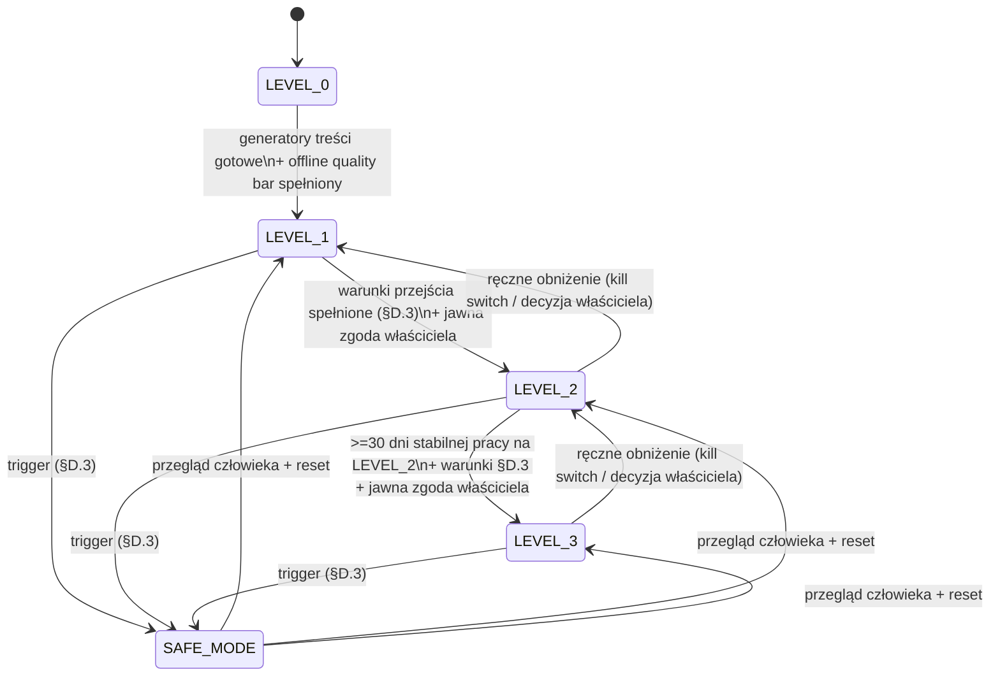

# IMPLEMENTATION PLAN — Nothing Is Accidental Agent (MVP)

Wersja: 1.0 · Data: 2026-07-11 · Status: **DO AKCEPTACJI** (kod nie został napisany)

Ten dokument jest wynikiem audytu istniejących założeń i propozycją finalnego planu MVP. Zawiera specyfikacje (modele danych, schemat bazy, interfejsy) jako **projekt techniczny**, nie jako kod produkcyjny. Żaden plik `.py` nie powstał. Nic nie jest publikowane. Nie użyto prawdziwych kluczy ani haseł.

Źródła, które porównano:
- `ARCHITECTURE.md`
- `IMPLEMENTATION_PROMPT.md`
- `README.md`
- `zalozenia projektu/PROJEKT_AGENT_SUBSTACK_NIC_NIE_JEST_PRZYPADKOWE.md` (dalej: **PROJEKT**)
- `zalzoewnia dla agenta/ZALOZENIA_DLA_AGENTA_SUBSTACK_GROWTH_MASTER.md` (dalej: **MASTER**)
- `instrukcja dla pisania artykulow/CLAUDE_INSTRUKCJA_NATURALNEGO_PISANIA.md` (dalej: **STYL**)
- `config/accounts.example.yaml`, `config/growth_policy.example.yaml`
- `.env`

---

## CZĘŚĆ A — AUDYT

### 0. Podsumowanie audytu (TL;DR)

Architektura jest **dojrzała i w większości spójna z celem**. Podział „Claude = mózg, lokalne narzędzia = ręce, SQLite = pamięć, Policy Engine = deterministyczna bramka" jest poprawny i gotowy na chmurę. Główne problemy to nie błędy koncepcji, lecz **rozbieżności liczbowe między dokumentami**, **jeden realny wyciek bezpieczeństwa** oraz **zbyt szeroki zakres MVP** (Definition of Done z `ARCHITECTURE.md` opisuje produkt na 6–7 faz, a nie pierwszy działający etap).

Werdykt skrótowy na 10 pytań:

| # | Pytanie | Werdykt |
|---|---------|---------|
| 1 | Architektura spójna z celem? | ✅ Tak, z drobnymi rozbieżnościami liczbowymi do ujednolicenia |
| 2 | Trzy tryby (FULL_PUBLICATION + 2× COMMENT_ONLY)? | ✅ Tak, wspierane w architekturze i configu |
| 3 | Lokalnie bez serwera, ale gotowe na chmurę? | ✅ Tak, dzięki portom/adapterom |
| 4 | Anthropic jako jedyny silnik językowy i researchowy? | ⚠️ Tak dla tekstu i researchu; **nie** dla grafik fotorealistycznych |
| 5 | Playwright odseparowany od logiki agenta? | ✅ Tak w projekcie (BrowserPort); wymaga twardej reguły „LLM proponuje, orchestrator wykonuje" |
| 6 | Pełna separacja kont/sesji/stylów/historii? | ⚠️ Zaprojektowana, ale jedna wspólna baza = ryzyko; wymaga twardego scoping po `account_id` |
| 7 | Limity bezpieczeństwa / kosztów / antyspam? | ✅ Dobrze pomyślane; drobna niespójność arytmetyki budżetu |
| 8 | Dokumentowanie budowy/screenów/błędów/kosztów/interwencji? | ⚠️ Zaplanowane w `ARCHITECTURE.md §19`, ale pliki nie istniały — tworzę je teraz |
| 9 | Założenia kompletne dla MVP? | ⚠️ Kompletne koncepcyjnie, niekompletne operacyjnie (atrybucja, metryki, auth Substacka) |
| 10 | Co jest zbyt ambitne na pierwszy etap? | Lista w sekcji A.10 |

---

### 1. Czy architektura jest spójna z celem projektu

**Tak.** Cel (zbudować i prowadzić wartościową publikację Substack półautonomicznie, maksymalizując realnych, zaangażowanych subskrybentów bez spamu) jest odzwierciedlony w:
- funkcji celu wzrostu (`ARCHITECTURE.md §13`, `growth_policy.example.yaml`),
- deterministycznym Policy Engine, który nie pozwala modelowi obejść zasad jakości/antyspamu,
- prymacie jakości nad wzrostem (MASTER §0: „wygrywa jakość, bezpieczeństwo i wiarygodność").

Spójność zaburzają **rozbieżności liczbowe** (patrz sekcja A + „Sprzeczności" na końcu). Nie są to błędy architektury, lecz brak jednego źródła prawdy dla wag scoringu i funkcji celu.

### 2. Czy system wspiera trzy tryby

**Tak.** `ARCHITECTURE.md §3` definiuje FULL_PUBLICATION, COMMENT_ONLY, DRAFT_ONLY, RESEARCH_ONLY, a `accounts.example.yaml` konfiguruje dokładnie trzy konta:
- `nothing_is_accidental` → FULL_PUBLICATION,
- `owner_account` → COMMENT_ONLY (obecnie `active: false`),
- `wife_account` → COMMENT_ONLY (obecnie `active: false`, `niche: []`).

Uwaga operacyjna: konto żony ma **pustą niszę** — bez zdefiniowanej niszy pipeline discovery komentarzy nie ma czego szukać. To decyzja do podjęcia (sekcja C).

### 3. Czy działa lokalnie bez serwera, ale pozwala przenieść do chmury

**Tak.** `ARCHITECTURE.md §20` definiuje sześć portów (Scheduler/Storage/Browser/SecretStore/FileStore/Notification) z lokalnymi adapterami (APScheduler, SQLite, Playwright, `.env`, filesystem) i ścieżką migracji (cloud scheduler, Postgres, kontener przeglądarki, secret manager, object storage). Zakazy („bez ścieżek absolutnych", „bez SQL poza repozytoriami", „logika biznesowa poza UI") są właściwe. Ten punkt jest mocną stroną projektu.

### 4. Czy Anthropic API może być jedynym silnikiem językowym i researchowym w MVP

**Częściowo.**
- **Język (pisanie, audyt, scoring, decyzje): tak.** Anthropic Messages API + `ModelRouter` (tani model do klasyfikacji/Notes/komentarzy, mocny do artykułów/audytu) jest wystarczający.
- **Research: tak, warunkowo.** Anthropic udostępnia server-side narzędzie web search oraz web fetch, więc research może działać bez zewnętrznego dostawcy. Trzeba jednak: (a) liczyć koszt web search per request w budżecie, (b) mieć twardą zasadę anty-halucynacyjną (min. źródeł, weryfikacja twierdzeń), bo research bez tego jest największym ryzykiem faktograficznym.
- **Grafiki: nie w pełni.** MASTER i PROJEKT zakładają „clean cinematic editorial images" (fotorealistyczna estetyka). Anthropic-only (`ARCHITECTURE.md §15`) daje tylko SVG→PNG, czyli schematy/diagramy/minimalistyczne okładki — **nie** obrazy fotorealistyczne. To realna sprzeczność wizji. Rekomendacja MVP: **SVG-only** za interfejsem `ImageProvider`, dołożenie zewnętrznego generatora później (poza MVP). Grafika i tak nie jest na ścieżce krytycznej pierwszego etapu (nie publikujemy).

### 5. Czy Playwright jest poprawnie oddzielony od logiki agenta

**Tak w projekcie.** `BrowserPort` + „Local Client Tools" oddzielają automatyzację od orchestracji. Wymagana twarda reguła architektoniczna (dopisana do zasad): **model językowy nigdy nie steruje przeglądarką bezpośrednio**. Model produkuje *propozycję akcji* (obiekt danych); Policy Engine ją waliduje; dopiero orchestrator wywołuje `BrowserPort`. To chroni przed prompt injection z treści internetowych (ryzyko `ARCHITECTURE.md §24.3`). Selektory i fallbacki trzymamy w jednym module, poza logiką agenta.

### 6. Czy konta/sesje/style/historie są w pełni odseparowane

**Zaprojektowane, wymaga wzmocnienia.**
- Sesje przeglądarki: osobny `browser_profile_path` per konto → OK (fizyczna separacja katalogów Playwright).
- Style pisania: osobny `writing_profile_path` per konto → OK (choć pliki `config/prompts/*.md` jeszcze nie istnieją).
- Historie/statystyki: **jedna wspólna baza SQLite** z kolumną `account_id`. To działa, ale każda operacja odczytu/zapisu MUSI filtrować po `account_id`; pojedynczy zapomniany filtr = wyciek danych/kontekstu między kontami. Rekomendacja: warstwa repozytoriów przyjmuje `account_id` jako obowiązkowy parametr; testy izolacji (sekcja test planu). Alternatywa (osobna baza per konto) jest bezpieczniejsza, ale komplikuje raporty zbiorcze — dla MVP zostajemy przy jednej bazie z twardym scopingiem.

### 7. Czy są wystarczające limity bezpieczeństwa, kosztów i antyspamu

**Tak, z drobną niespójnością.**
- Antyspam: limity komentarzy (3–5/dzień/konto, 1/autor/dzień), link ratio 5–10%, deduplikacja semantyczna, cooldown po ukryciu — kompletne (`ARCHITECTURE.md §11`, `growth_policy.example.yaml`).
- Bezpieczeństwo: KILL_SWITCH, pause per konto, dry_run, stop po serii błędów/wylogowaniu/zmianie UI — kompletne (`§21`).
- Koszty: `max_daily_cost_usd: 2.00` i `max_monthly_cost_usd: 40.00`. **Niespójność arytmetyczna**: 2.00 × 30 = 60 > 40. Dzienny limit jako sufit jest OK, ale przy trafieniu w sufit codziennie przekroczy budżet miesięczny. Rekomendacja: dzienny limit ~1.30 USD lub twardy priorytet limitu miesięcznego (stop, gdy `month_to_date >= 40`, niezależnie od dziennego).

### 8. Czy dokumentowanie jest uwzględnione

**Zaplanowane, ale nie istniało.** `ARCHITECTURE.md §19` przewiduje `docs/BUILD_LOG.md`, `DECISIONS.md`, `ERRORS_AND_FAILURES.md`, `HUMAN_INTERVENTIONS.md`, `ARTICLE_EVIDENCE.md`, `weekly-reports/`. Fizycznie folder `docs/` nie istniał. **Tworzę w tym kroku** wszystkie wymagane pliki + `SCREENSHOT_INDEX.md` i `COSTS.csv` (patrz „Utworzone pliki"). Dokumentowanie kosztów jest też wsparte tabelą `model_usage` w bazie — CSV to warstwa czytelna dla człowieka, baza to źródło prawdy.

### 9. Czy założenia są kompletne dla MVP

**Kompletne koncepcyjnie, niekompletne operacyjnie.** Luki do domknięcia przed kodowaniem:
- **Atrybucja subskrypcji** — MASTER liczy „konwersję profil → subskrypcja" i „subskrypcje z Notes/komentarzy", ale Substack nie udostępnia takiej atrybucji. `ARCHITECTURE.md §13` sam to przyznaje („system zapisuje estymację i oznacza jako estymację"). MVP musi traktować te metryki jako *estymacje*, nie fakty.
- **Auth Substacka** — Substack loguje magic-linkiem e-mail (bez hasła). To upraszcza zasadę „bez haseł" (nie ma hasła do przechowania), ale wymaga procedury ręcznego logowania przez link i wykrywania wygaśnięcia sesji.
- **Pobieranie metryk** — scraping statystyk Substacka jest kruchy (zmiany UI). MVP powinien mieć minimalny, tolerancyjny na błędy kolektor + ręczne uzupełnianie.
- **Pliki profili stylu** `config/prompts/*.md` nie istnieją — trzeba je utworzyć (bazując na STYL i profilu „Chaos Engine").
- **Brak `.env.example`, `.gitignore`** — mimo że `README`/`ARCHITECTURE §19` je zakładają.

### 10. Co jest zbyt ambitne na pierwszy etap

Do przesunięcia poza pierwszy MVP (kolejność wg `ARCHITECTURE.md §22`, ale zawężona):
1. **LEVEL_3 (pełna autonomia)** — dokumenty same nazywają to eksperymentalnym; nie w MVP.
2. **Publikowanie na Substacku przez Playwright** — `IMPLEMENTATION_PROMPT.md` mówi wprost: „Nie wdrażaj jeszcze publikowania". DoD z `§23` (17 zdolności, w tym publikacja) to cel końcowy, nie pierwszy etap.
3. **Growth Optimizer / automatyczna zmiana strategii** — po pierwsze potrzebne są dane z ≥7 dni.
4. **Recommendations / relacje z autorami / propozycje współpracy** — kanał ludzki, wysokie ryzyko, poza MVP.
5. **A/B-like experiments engine** — dopiero gdy jest ruch.
6. **Atrybucja subskrypcji jako metryka twarda** — Substack tego nie daje.
7. **Generator grafik fotorealistycznych** — SVG-only w MVP.
8. **Adaptery chmurowe (Postgres, kontener przeglądarki, secret manager)** — porty tak, adaptery później.
9. **System tray / bogaty panel** — w MVP wystarczy minimalny panel kolejki (nawet CLI/Streamlit).
10. **Restack/like automation** — poza pierwszym etapem.

---

## CZĘŚĆ B — PROJEKT MVP

### 1. Finalna architektura MVP

Warstwy (od dołu):

```
┌───────────────────────────────────────────────────────────────┐
│  UI (Streamlit lub FastAPI+HTML, tylko localhost)              │
│  kolejka zatwierdzeń · koszty · logi · screeny · KILL_SWITCH   │
└───────────────▲───────────────────────────────────────────────┘
                │ (czyta/zapisuje przez StoragePort — zero SQL w UI)
┌───────────────┴───────────────────────────────────────────────┐
│  ORCHESTRATOR (pętla runu, stan, retry, respektowanie limitów) │
│    ├── PolicyEngine (deterministyczna bramka: mode, autonomy,  │
│    │      limity, budżet, duplikaty, częstotliwość, approval)  │
│    ├── Workflows: topics · research · article · note ·         │
│    │      comment · analytics                                  │
│    └── ProposedAction → walidacja → wykonanie                  │
└───────┬───────────────────────┬───────────────────────────────┘
        │                        │
┌───────▼─────────┐   ┌──────────▼──────────────────────────────┐
│ Anthropic Layer │   │ Local Tools (za PORTAMI)                │
│ AnthropicClient │   │ BrowserPort(Playwright)  StoragePort(DB)│
│ ModelRouter     │   │ FileStorePort  SecretStorePort         │
│ PromptRegistry  │   │ SchedulerPort  NotificationPort        │
│ UsageTracker    │   │ ImageProvider(SVG→PNG)                  │
│ (web search)    │   │ MetricsCollector                       │
└─────────────────┘   └────────────────────────────────────────┘
```

Zasady nadrzędne (twarde):
1. **Model językowy nie dotyka przeglądarki ani bazy bezpośrednio.** Produkuje dane (propozycje). Wykonuje orchestrator.
2. **PolicyEngine jest deterministyczny** i stoi przed każdą akcją zewnętrzną i każdym wydatkiem.
3. **Każdy odczyt/zapis stanu przechodzi przez StoragePort z obowiązkowym `account_id`.**
4. **`dry_run` i `KILL_SWITCH` sprawdzane są jako pierwsze**, przed dowolną akcją.
5. **Nazwy modeli, limity, ścieżki — z konfiguracji, nie z kodu.**
6. **Nic nie publikujemy w MVP-0** (patrz plan etapów).

Rozstrzygnięcia rozbieżności (przyjęte jako „źródło prawdy" na czas MVP; wpisane do `DECISIONS.md`):
- **Scoring tematu**: przyjmujemy wersję z `ARCHITECTURE.md §7` = `growth_policy` (ciekawość 25 / źródła 20 / nieoczywistość 15 / uniwersalność 15 / dyskusja 10 / wizual 10 / oryginalność 5). Wersja z PROJEKT §5 (inne wagi) zostaje odrzucona.
- **Funkcja celu**: przyjmujemy `growth_policy.example.yaml` = `ARCHITECTURE.md §13` (45/20/15/10/5/5). Wersja z MASTER §18 (40/20/15/10/10/5 + „konwersja") zostaje jako *inspiracja*, nie kod.
- **Grafiki**: SVG-only za `ImageProvider`.
- **Autonomia MVP**: sufit = LEVEL_1 (auto research + auto szkice, publikacja zawsze za akceptacją). LEVEL_2 dopiero po ręcznej decyzji po ≥1 tygodniu.

### 2. Finalna struktura folderów

Zachowuję strukturę z `ARCHITECTURE.md §19` z korektami (dodane pliki, których brakowało). W pierwszym etapie powstają tylko foldery realnie używane — reszta to szkielet docelowy.

```text
nothing-is-accidental-agent/
├── app/
│   ├── core/              # config, typy, zdarzenia, id, zegar, budżet, błędy
│   ├── llm/               # AnthropicClient, ModelRouter, PromptRegistry,
│   │                      #   ToolRegistry, UsageTracker, PromptCacheManager
│   ├── orchestrator/      # pętla runu, stan, retry, ProposedAction
│   ├── policies/          # PolicyEngine (deterministyczny)
│   ├── workflows/
│   │   ├── topics/        # discover, score, rank
│   │   ├── research/      # research card, weryfikacja źródeł
│   │   ├── articles/      # outline, draft, fact/style/growth audit
│   │   ├── notes/
│   │   ├── comments/      # discovery, scoring, generacja (bez publikacji w MVP-0)
│   │   ├── analytics/     # metryki, raport tygodniowy
│   │   └── evidence/      # zbieranie dowodów do ARTICLE_EVIDENCE.md
│   ├── tools/
│   │   ├── browser/       # Playwright adapter (BrowserPort) — Faza browser
│   │   ├── files/         # FileStore adapter
│   │   ├── screenshots/   # screenshoty + indeks
│   │   ├── images/        # ImageProvider (SVG→PNG)
│   │   └── metrics/       # MetricsCollector
│   ├── storage/           # StoragePort + repozytoria SQLite + migracje
│   ├── scheduler/         # SchedulerPort + APScheduler adapter
│   ├── secrets/           # SecretStorePort + .env adapter
│   ├── notifications/     # NotificationPort (lokalnie: log/plik/desktop)
│   └── ui/                # panel localhost
├── config/
│   ├── accounts.example.yaml     # (istnieje)
│   ├── accounts.yaml             # (lokalny, gitignored — tworzy user)
│   ├── growth_policy.example.yaml# (istnieje)
│   ├── growth_policy.yaml        # (lokalny, gitignored)
│   └── prompts/
│       ├── nothing_is_accidental.md   # DO UTWORZENIA (styl NIA, EN)
│       ├── owner_account.md           # DO UTWORZENIA
│       └── wife_account.md            # DO UTWORZENIA
├── data/                 # gitignored w całości
│   ├── browser-profiles/ # osobny katalog per konto
│   ├── screenshots/
│   ├── exports/
│   └── agent.db
├── docs/
│   ├── IMPLEMENTATION_PLAN.md      # (ten plik)
│   ├── BUILD_LOG.md
│   ├── DECISIONS.md
│   ├── ERRORS_AND_FAILURES.md
│   ├── HUMAN_INTERVENTIONS.md
│   ├── ARTICLE_EVIDENCE.md
│   ├── SCREENSHOT_INDEX.md
│   ├── COSTS.csv
│   └── weekly-reports/
├── tests/
├── scripts/              # migracje, seed, narzędzia dev
├── .env                  # LOKALNY, gitignored — NIE commitować
├── .env.example          # DO UTWORZENIA (placeholdery, bez sekretów)
├── .gitignore            # DO UTWORZENIA
├── pyproject.toml
└── README.md
```

Zmiany względem `§19`: dodane `app/secrets/`, `app/notifications/`, `app/tools/images/`, pliki `.env.example`, `.gitignore`, `SCREENSHOT_INDEX.md`, `COSTS.csv`, jawne `accounts.yaml`/`growth_policy.yaml` jako lokalne.

### 3. Modele Pydantic (specyfikacja, nie kod produkcyjny)

Poniżej projekt modeli domenowych. To specyfikacja do przyszłej implementacji w `app/core/models.py` — **nie jest to plik produkcyjny**.

```python
from __future__ import annotations
from datetime import datetime, date
from enum import Enum
from pydantic import BaseModel, Field, HttpUrl

# --- Enumeracje ---
class AccountMode(str, Enum):
    FULL_PUBLICATION = "FULL_PUBLICATION"
    COMMENT_ONLY = "COMMENT_ONLY"
    DRAFT_ONLY = "DRAFT_ONLY"
    RESEARCH_ONLY = "RESEARCH_ONLY"

class AutonomyLevel(str, Enum):
    LEVEL_0 = "LEVEL_0"   # tylko szkice
    LEVEL_1 = "LEVEL_1"   # auto research/szkice, publikacja za akceptacją
    LEVEL_2 = "LEVEL_2"   # auto wybrane Notes
    LEVEL_3 = "LEVEL_3"   # kontrolowana pełna autonomia (poza MVP)

class WorkflowType(str, Enum):
    TOPIC = "TOPIC"; RESEARCH = "RESEARCH"; ARTICLE = "ARTICLE"
    NOTE = "NOTE"; COMMENT = "COMMENT"; ANALYTICS = "ANALYTICS"

class ContentType(str, Enum):
    ARTICLE = "ARTICLE"; NOTE = "NOTE"

class ContentStatus(str, Enum):
    DRAFT = "DRAFT"; PENDING_APPROVAL = "PENDING_APPROVAL"
    APPROVED = "APPROVED"; REJECTED = "REJECTED"
    SCHEDULED = "SCHEDULED"; PUBLISHED = "PUBLISHED"; FAILED = "FAILED"

class InteractionType(str, Enum):
    COMMENT = "COMMENT"; LIKE = "LIKE"; RESTACK = "RESTACK"

class InteractionStatus(str, Enum):
    DRAFT = "DRAFT"; PENDING_APPROVAL = "PENDING_APPROVAL"
    APPROVED = "APPROVED"; REJECTED = "REJECTED"
    PUBLISHED = "PUBLISHED"; HIDDEN = "HIDDEN"; FAILED = "FAILED"

class ApprovalDecision(str, Enum):
    PENDING = "PENDING"; APPROVED = "APPROVED"
    REJECTED = "REJECTED"; EDITED = "EDITED"

class RunStatus(str, Enum):
    RUNNING = "RUNNING"; SUCCESS = "SUCCESS"
    FAILED = "FAILED"; STOPPED = "STOPPED"; DRY_RUN = "DRY_RUN"

class SourceType(str, Enum):
    PRIMARY = "PRIMARY"; SECONDARY = "SECONDARY"; DATA = "DATA"; OTHER = "OTHER"

# --- Konfiguracja konta (z YAML) ---
class AccountPolicy(BaseModel):
    require_article_approval: bool = True
    require_note_approval: bool = True
    require_comment_approval: bool = True
    require_restack_approval: bool = True
    daily_comment_limit: int = 5
    daily_note_limit: int = 2
    weekly_article_limit: int = 2
    max_per_author_per_day: int = 1
    allow_links: bool = True
    link_ratio_limit: float = 0.10

class Account(BaseModel):
    id: str
    display_name: str
    mode: AccountMode
    autonomy_level: AutonomyLevel = AutonomyLevel.LEVEL_1
    active: bool = False
    niche: list[str] = Field(default_factory=list)
    languages: list[str] = Field(default_factory=lambda: ["en"])
    browser_profile_path: str
    writing_profile_path: str
    allowed_actions: list[str] = Field(default_factory=list)
    policies: AccountPolicy = Field(default_factory=AccountPolicy)

# --- Domena treści ---
class Topic(BaseModel):
    id: int | None = None
    account_id: str
    title: str
    question: str | None = None
    score: float | None = None
    score_breakdown: dict[str, float] = Field(default_factory=dict)
    status: str = "DISCOVERED"   # DISCOVERED|SCORED|SELECTED|REJECTED|USED
    source: str | None = None
    created_at: datetime = Field(default_factory=datetime.utcnow)

class Source(BaseModel):
    id: int | None = None
    research_card_id: int
    url: HttpUrl
    title: str | None = None
    source_type: SourceType = SourceType.OTHER
    published_at: date | None = None
    verified: bool = False

class ResearchCard(BaseModel):
    id: int | None = None
    topic_id: int
    question: str
    thesis: str
    mechanism: str | None = None
    facts_confirmed: list[str] = Field(default_factory=list)
    facts_uncertain: list[str] = Field(default_factory=list)
    contradictions: list[str] = Field(default_factory=list)
    counterargument: str | None = None
    citable_numbers: list[str] = Field(default_factory=list)
    visual_idea: str | None = None
    confidence: float = 0.0    # 0..1
    sources: list[Source] = Field(default_factory=list)
    created_at: datetime = Field(default_factory=datetime.utcnow)

class ContentItem(BaseModel):
    id: int | None = None
    account_id: str
    type: ContentType
    title: str | None = None
    subtitle: str | None = None
    body: str = ""
    status: ContentStatus = ContentStatus.DRAFT
    score: float | None = None
    duplicate_score: float | None = None
    research_card_id: int | None = None
    scheduled_at: datetime | None = None
    published_at: datetime | None = None
    external_url: HttpUrl | None = None

class TargetItem(BaseModel):
    id: int | None = None
    account_id: str
    author_name: str
    author_url: HttpUrl | None = None
    item_url: HttpUrl
    item_type: str                 # POST|NOTE
    relevance_score: float | None = None
    last_interaction_at: datetime | None = None

class Interaction(BaseModel):
    id: int | None = None
    account_id: str
    target_item_id: int | None = None
    type: InteractionType
    body: str = ""
    contains_link: bool = False
    status: InteractionStatus = InteractionStatus.DRAFT
    published_at: datetime | None = None
    likes_received: int = 0
    replies_received: int = 0

class Approval(BaseModel):
    id: int | None = None
    account_id: str
    object_type: str               # CONTENT_ITEM|INTERACTION
    object_id: int
    decision: ApprovalDecision = ApprovalDecision.PENDING
    decided_at: datetime | None = None
    notes: str | None = None

class MetricsDaily(BaseModel):
    id: int | None = None
    account_id: str
    date: date
    subscribers: int | None = None
    followers: int | None = None
    views: int | None = None
    likes_received: int | None = None
    comments_received: int | None = None
    restacks: int | None = None
    profile_visits: int | None = None
    is_estimated: bool = False     # atrybucja/estymacje oznaczone jawnie

# --- Operacyjne / koszty / dowody ---
class ModelUsage(BaseModel):
    id: int | None = None
    run_id: str
    model: str
    input_tokens: int = 0
    output_tokens: int = 0
    cache_read_tokens: int = 0
    cache_write_tokens: int = 0
    web_search_requests: int = 0
    estimated_cost_usd: float = 0.0
    created_at: datetime = Field(default_factory=datetime.utcnow)

class Run(BaseModel):
    id: str                        # uuid
    account_id: str
    workflow: WorkflowType
    status: RunStatus = RunStatus.RUNNING
    current_state: str | None = None
    started_at: datetime = Field(default_factory=datetime.utcnow)
    finished_at: datetime | None = None
    cost_usd: float = 0.0
    error: str | None = None
    human_intervention_count: int = 0

class Screenshot(BaseModel):
    id: int | None = None
    run_id: str
    account_id: str
    path: str
    description: str | None = None
    created_at: datetime = Field(default_factory=datetime.utcnow)

# --- Propozycja akcji: jedyny sposób, w jaki LLM "prosi" o działanie ---
class ProposedAction(BaseModel):
    account_id: str
    action: str                    # np. "publish_note", "publish_comment"
    payload: dict = Field(default_factory=dict)
    rationale: str | None = None
    requires_approval: bool = True
```

### 4. Schemat SQLite (specyfikacja DDL)

Projekt migracji `0001_init.sql`. **Specyfikacja, nie plik produkcyjny.** `PRAGMA foreign_keys = ON`. Klucz obcy `account_id` wszędzie, gdzie dane są per-konto.

```sql
PRAGMA foreign_keys = ON;

CREATE TABLE accounts (
    id                    TEXT PRIMARY KEY,
    name                  TEXT NOT NULL,
    mode                  TEXT NOT NULL,          -- AccountMode
    autonomy_level        TEXT NOT NULL,          -- AutonomyLevel
    active                INTEGER NOT NULL DEFAULT 0,
    browser_profile_path  TEXT NOT NULL,
    writing_profile_path  TEXT NOT NULL,
    created_at            TEXT NOT NULL DEFAULT (datetime('now'))
);

CREATE TABLE account_policies (
    account_id                TEXT PRIMARY KEY REFERENCES accounts(id) ON DELETE CASCADE,
    daily_comment_limit       INTEGER NOT NULL DEFAULT 5,
    daily_note_limit          INTEGER NOT NULL DEFAULT 2,
    weekly_article_limit      INTEGER NOT NULL DEFAULT 2,
    max_per_author_per_day    INTEGER NOT NULL DEFAULT 1,
    require_comment_approval  INTEGER NOT NULL DEFAULT 1,
    require_note_approval     INTEGER NOT NULL DEFAULT 1,
    require_article_approval  INTEGER NOT NULL DEFAULT 1,
    require_restack_approval  INTEGER NOT NULL DEFAULT 1,
    allow_links               INTEGER NOT NULL DEFAULT 1,
    link_ratio_limit          REAL NOT NULL DEFAULT 0.10
);

CREATE TABLE topics (
    id              INTEGER PRIMARY KEY AUTOINCREMENT,
    account_id      TEXT NOT NULL REFERENCES accounts(id) ON DELETE CASCADE,
    title           TEXT NOT NULL,
    question        TEXT,
    score           REAL,
    score_breakdown TEXT,                          -- JSON
    status          TEXT NOT NULL DEFAULT 'DISCOVERED',
    source          TEXT,
    created_at      TEXT NOT NULL DEFAULT (datetime('now'))
);
CREATE INDEX ix_topics_account ON topics(account_id, status);

CREATE TABLE research_cards (
    id                 INTEGER PRIMARY KEY AUTOINCREMENT,
    topic_id           INTEGER NOT NULL REFERENCES topics(id) ON DELETE CASCADE,
    question           TEXT NOT NULL,
    thesis             TEXT NOT NULL,
    mechanism          TEXT,
    facts_json         TEXT,                       -- confirmed/uncertain/contradictions
    counterargument    TEXT,
    citable_numbers    TEXT,                       -- JSON
    visual_idea        TEXT,
    confidence         REAL NOT NULL DEFAULT 0.0,
    created_at         TEXT NOT NULL DEFAULT (datetime('now'))
);
CREATE INDEX ix_research_topic ON research_cards(topic_id);

CREATE TABLE sources (
    id                INTEGER PRIMARY KEY AUTOINCREMENT,
    research_card_id  INTEGER NOT NULL REFERENCES research_cards(id) ON DELETE CASCADE,
    url               TEXT NOT NULL,
    title             TEXT,
    source_type       TEXT NOT NULL DEFAULT 'OTHER',
    published_at      TEXT,
    verified          INTEGER NOT NULL DEFAULT 0
);
CREATE INDEX ix_sources_card ON sources(research_card_id);

CREATE TABLE content_items (
    id                INTEGER PRIMARY KEY AUTOINCREMENT,
    account_id        TEXT NOT NULL REFERENCES accounts(id) ON DELETE CASCADE,
    type              TEXT NOT NULL,               -- ContentType
    title             TEXT,
    subtitle          TEXT,
    body              TEXT NOT NULL DEFAULT '',
    status            TEXT NOT NULL DEFAULT 'DRAFT',
    score             REAL,
    duplicate_score   REAL,
    research_card_id  INTEGER REFERENCES research_cards(id) ON DELETE SET NULL,
    scheduled_at      TEXT,
    published_at      TEXT,
    external_url      TEXT,
    created_at        TEXT NOT NULL DEFAULT (datetime('now'))
);
CREATE INDEX ix_content_account ON content_items(account_id, type, status);

CREATE TABLE target_items (
    id                  INTEGER PRIMARY KEY AUTOINCREMENT,
    account_id          TEXT NOT NULL REFERENCES accounts(id) ON DELETE CASCADE,
    author_name         TEXT NOT NULL,
    author_url          TEXT,
    item_url            TEXT NOT NULL,
    item_type           TEXT NOT NULL,             -- POST|NOTE
    relevance_score     REAL,
    last_interaction_at TEXT,
    created_at          TEXT NOT NULL DEFAULT (datetime('now')),
    UNIQUE(account_id, item_url)
);
CREATE INDEX ix_target_account ON target_items(account_id);

CREATE TABLE interactions (
    id               INTEGER PRIMARY KEY AUTOINCREMENT,
    account_id       TEXT NOT NULL REFERENCES accounts(id) ON DELETE CASCADE,
    target_item_id   INTEGER REFERENCES target_items(id) ON DELETE SET NULL,
    type             TEXT NOT NULL,                -- InteractionType
    body             TEXT NOT NULL DEFAULT '',
    contains_link    INTEGER NOT NULL DEFAULT 0,
    status           TEXT NOT NULL DEFAULT 'DRAFT',
    published_at     TEXT,
    likes_received   INTEGER NOT NULL DEFAULT 0,
    replies_received INTEGER NOT NULL DEFAULT 0,
    created_at       TEXT NOT NULL DEFAULT (datetime('now'))
);
CREATE INDEX ix_interactions_account ON interactions(account_id, type, status);

CREATE TABLE approvals (
    id           INTEGER PRIMARY KEY AUTOINCREMENT,
    account_id   TEXT NOT NULL REFERENCES accounts(id) ON DELETE CASCADE,
    object_type  TEXT NOT NULL,                    -- CONTENT_ITEM|INTERACTION
    object_id    INTEGER NOT NULL,
    decision     TEXT NOT NULL DEFAULT 'PENDING',
    decided_at   TEXT,
    notes        TEXT,
    created_at   TEXT NOT NULL DEFAULT (datetime('now'))
);
CREATE INDEX ix_approvals_account ON approvals(account_id, decision);

CREATE TABLE metrics_daily (
    id                INTEGER PRIMARY KEY AUTOINCREMENT,
    account_id        TEXT NOT NULL REFERENCES accounts(id) ON DELETE CASCADE,
    date              TEXT NOT NULL,
    subscribers       INTEGER,
    followers         INTEGER,
    views             INTEGER,
    likes_received    INTEGER,
    comments_received INTEGER,
    restacks          INTEGER,
    profile_visits    INTEGER,
    is_estimated      INTEGER NOT NULL DEFAULT 0,
    UNIQUE(account_id, date)
);

CREATE TABLE runs (
    id                       TEXT PRIMARY KEY,     -- uuid
    account_id               TEXT NOT NULL REFERENCES accounts(id) ON DELETE CASCADE,
    workflow                 TEXT NOT NULL,
    status                   TEXT NOT NULL DEFAULT 'RUNNING',
    current_state            TEXT,
    started_at               TEXT NOT NULL DEFAULT (datetime('now')),
    finished_at              TEXT,
    cost_usd                 REAL NOT NULL DEFAULT 0.0,
    error                    TEXT,
    human_intervention_count INTEGER NOT NULL DEFAULT 0
);
CREATE INDEX ix_runs_account ON runs(account_id, workflow, status);

CREATE TABLE model_usage (
    id                  INTEGER PRIMARY KEY AUTOINCREMENT,
    run_id              TEXT NOT NULL REFERENCES runs(id) ON DELETE CASCADE,
    model               TEXT NOT NULL,
    input_tokens        INTEGER NOT NULL DEFAULT 0,
    output_tokens       INTEGER NOT NULL DEFAULT 0,
    cache_read_tokens   INTEGER NOT NULL DEFAULT 0,
    cache_write_tokens  INTEGER NOT NULL DEFAULT 0,
    web_search_requests INTEGER NOT NULL DEFAULT 0,
    estimated_cost_usd  REAL NOT NULL DEFAULT 0.0,
    created_at          TEXT NOT NULL DEFAULT (datetime('now'))
);
CREATE INDEX ix_usage_run ON model_usage(run_id);

CREATE TABLE screenshots (
    id          INTEGER PRIMARY KEY AUTOINCREMENT,
    run_id      TEXT NOT NULL REFERENCES runs(id) ON DELETE CASCADE,
    account_id  TEXT NOT NULL REFERENCES accounts(id) ON DELETE CASCADE,
    path        TEXT NOT NULL,
    description TEXT,
    created_at  TEXT NOT NULL DEFAULT (datetime('now'))
);

-- schema_migrations do wersjonowania migracji
CREATE TABLE schema_migrations (
    version    TEXT PRIMARY KEY,
    applied_at TEXT NOT NULL DEFAULT (datetime('now'))
);
```

### 5. Lista tabel i relacji

| Tabela | Klucz | Relacje (FK) | Rola |
|--------|-------|--------------|------|
| `accounts` | `id` (TEXT) | — | rejestr kont |
| `account_policies` | `account_id` | 1–1 → `accounts` | limity/approval per konto |
| `topics` | `id` | N–1 → `accounts` | tematy per konto |
| `research_cards` | `id` | N–1 → `topics` | karta researchu na temat |
| `sources` | `id` | N–1 → `research_cards` | źródła karty |
| `content_items` | `id` | N–1 → `accounts`, opc. N–1 → `research_cards` | artykuły i Notes |
| `target_items` | `id` | N–1 → `accounts` | posty/autorzy do komentowania |
| `interactions` | `id` | N–1 → `accounts`, opc. N–1 → `target_items` | komentarze/like/restack |
| `approvals` | `id` | N–1 → `accounts` (+ polimorf. `object_type/object_id`) | decyzje człowieka |
| `metrics_daily` | `id` | N–1 → `accounts`, UNIQUE(account,date) | dzienne metryki (z flagą estymacji) |
| `runs` | `id` (uuid) | N–1 → `accounts` | wykonania workflow |
| `model_usage` | `id` | N–1 → `runs` | zużycie tokenów/koszt |
| `screenshots` | `id` | N–1 → `runs`, N–1 → `accounts` | dowody wizualne |
| `schema_migrations` | `version` | — | wersjonowanie schematu |

Kaskady: usunięcie konta kasuje jego dane (`ON DELETE CASCADE`); usunięcie karty researchu odpina ją od treści (`SET NULL`), by nie tracić opublikowanego artykułu.

Relacja polimorficzna `approvals` (`object_type` + `object_id`) celowo bez twardego FK — obsługuje zarówno `content_items`, jak i `interactions`; integralność pilnuje warstwa repozytoriów.

### 6. Interfejsy (porty)

Specyfikacja portów jako `typing.Protocol`. **Projekt, nie kod produkcyjny.** Adaptery lokalne w nawiasach.

```python
from typing import Protocol, Callable, Sequence, Any
from datetime import datetime

class SchedulerPort(Protocol):
    """Lokalnie: APScheduler. Później: cloud scheduler."""
    def schedule(self, job_id: str, cron: str, func: Callable[..., Any],
                 account_id: str | None = None) -> None: ...
    def remove(self, job_id: str) -> None: ...
    def list_jobs(self) -> list[dict]: ...
    def start(self) -> None: ...
    def shutdown(self) -> None: ...

class StoragePort(Protocol):
    """Lokalnie: SQLite + repozytoria. Później: Postgres.
    KAŻDA metoda per-konto wymaga account_id — brak globalnych odczytów treści."""
    def add(self, account_id: str, entity: Any) -> Any: ...
    def get(self, account_id: str, entity_type: type, entity_id: int | str) -> Any | None: ...
    def list(self, account_id: str, entity_type: type, **filters: Any) -> Sequence[Any]: ...
    def update(self, account_id: str, entity: Any) -> Any: ...
    def count(self, account_id: str, entity_type: type, **filters: Any) -> int: ...
    def transaction(self): ...  # context manager

class BrowserPort(Protocol):
    """Lokalnie: Playwright (persistent context per konto). Później: kontener.
    Model NIGDY nie wywołuje tego bezpośrednio — tylko orchestrator po walidacji Policy."""
    def open_feed(self, account_id: str) -> None: ...
    def search_publications(self, account_id: str, query: str) -> list[dict]: ...
    def read_post(self, account_id: str, url: str) -> dict: ...
    def read_note(self, account_id: str, url: str) -> dict: ...
    def open_profile(self, account_id: str, url: str) -> dict: ...
    def create_article_draft(self, account_id: str, item: Any) -> str: ...   # zwraca url draftu
    def publish_article(self, account_id: str, item: Any) -> str: ...        # POZA MVP-0
    def publish_note(self, account_id: str, item: Any) -> str: ...           # POZA MVP-0
    def publish_comment(self, account_id: str, interaction: Any) -> str: ... # POZA MVP-0
    def like_item(self, account_id: str, url: str) -> None: ...
    def restack_item(self, account_id: str, url: str, note: str | None) -> None: ...
    def collect_metrics(self, account_id: str) -> dict: ...
    def is_logged_in(self, account_id: str) -> bool: ...
    def take_screenshot(self, account_id: str, label: str) -> str: ...       # zwraca path

class SecretStorePort(Protocol):
    """Lokalnie: .env (tylko klucze API, NIGDY hasła Substacka). Później: secret manager."""
    def get(self, key: str) -> str | None: ...
    def require(self, key: str) -> str: ...   # rzuca, gdy brak

class FileStorePort(Protocol):
    """Lokalnie: filesystem (data/). Później: object storage."""
    def save(self, account_id: str, category: str, filename: str, data: bytes) -> str: ...
    def read(self, path: str) -> bytes: ...
    def url_for(self, path: str) -> str: ...
    def list(self, account_id: str, category: str) -> list[str]: ...

class NotificationPort(Protocol):
    """Lokalnie: log/plik/desktop toast. Później: webhook/mobile."""
    def notify(self, level: str, title: str, message: str,
               account_id: str | None = None) -> None: ...
    def request_approval(self, account_id: str, object_type: str, object_id: int) -> None: ...
```

### 7. Przepływy

Notacja: `[LLM]` = decyzja/generacja modelu, `[POLICY]` = deterministyczna bramka, `[HUMAN]` = akceptacja człowieka, `[TOOL]` = akcja lokalna. W MVP-0 wszystkie `publish_*` są wyłączone (`dry_run`), zamiast publikacji zapis do bazy + kolejka.

**7.1 Wybór tematu**
```
[SCHED] wyzwolenie → [POLICY] budżet/kill-switch/dry_run OK?
 → [LLM] discover 10–20 tematów (web search)
 → [POLICY] normalize + duplicate check (vs topics.status=USED, próg podobieństwa)
 → [POLICY] niche check (zgodność z account.niche)
 → [LLM] source availability check (czy są min. 3 wiarygodne źródła)
 → [LLM] growth scoring (wagi z growth_policy: 25/20/15/15/10/10/5)
 → [POLICY] ranking + próg (artykuł ≥75, Note ≥65)
 → [TOOL] zapis topics (status SCORED/SELECTED) + koszt do model_usage
```

**7.2 Research**
```
[wejście: SELECTED topic] → [LLM] pytanie/teza/nisza/głębokość
 → [TOOL] Anthropic web search + web fetch → zebranie źródeł
 → [LLM] budowa Research Card (teza, mechanizm, fakty potwierdzone/niepewne,
          sprzeczności, kontrargument, cytowalne liczby, confidence)
 → [POLICY] gate: ≥3 sensowne źródła? kluczowa teza poparta? brak udawanego
          doświadczenia? confidence ≥ próg?  (jeśli nie → STOP, temat odrzucony)
 → [TOOL] zapis research_cards + sources (verified flag)
```

**7.3 Artykuł**
```
[wejście: Research Card] → [LLM] outline → [LLM] draft v1 (wg STYL + profil konta)
 → [LLM] fact audit (każde twierdzenie ↔ źródło)
 → [LLM] style audit (lista zakazanych fraz/schematów z STYL)
 → [LLM] growth audit (tytuł bez clickbaitu, pierwsze 150 słów, jeden mechanizm,
          materiał na Notes, prowokuje komentarz)
 → [LLM] draft v2 + warianty tytułu + koncept okładki (SVG brief)
 → [POLICY] score ≥75, duplicate < próg, długość 900–1500
 → [TOOL] zapis content_items(type=ARTICLE, status=PENDING_APPROVAL)
 → [HUMAN] akceptacja (zawsze dla artykułu) → APPROVED
 → (MVP-0: STOP na APPROVED; publikacja dopiero w fazie browser)
```

**7.4 Note**
```
[źródło: artykuł / research / komentarz / liczba / pytanie / mini-mechanizm]
 → [LLM] generacja Note (jedna myśl, własny opening fingerprint)
 → [POLICY] duplicate score < 0.80, quality ≥ próg konta, link ratio OK,
          dzienny limit (daily_note_limit) nieprzekroczony
 → [TOOL] zapis content_items(type=NOTE, status=PENDING_APPROVAL)
 → [HUMAN] akceptacja (LEVEL_1) → APPROVED
 → (LEVEL_2, poza MVP-0: wybrane typy Notes auto-APPROVED)
```

**7.5 Komentarz**
```
[SCHED] skan → [LLM/TOOL] discover kandydatów (słowa kluczowe, autorzy, świeżość)
 → [LLM] scoring miejsca (25/25/15/15/10/10), próg ≥70
 → [POLICY] limity: ≤5/dzień/konto, ≤1/autor/dzień, cooldown po ukryciu
 → [LLM] generacja komentarza (odniesienie do fragmentu, dodaje mechanizm/przykład/
          kontrargument; zero „great post"; bez zaproszenia na profil)
 → [POLICY] deduplikacja semantyczna, link ratio (5–10%)
 → [TOOL] zapis interactions(status=PENDING_APPROVAL) + target_items
 → [HUMAN] akceptacja (ZAWSZE dla komentarza) → APPROVED
 → (MVP-0: STOP; publikacja w fazie browser)
```

**7.6 Publikacja** (POZA MVP-0 — projekt docelowy)
```
[wejście: APPROVED content/interaction] → [POLICY] ponowna walidacja
   (kill-switch, pause konta, dry_run, limity, sesja zalogowana)
 → [TOOL/BROWSER] is_logged_in? (jeśli nie → STOP + notyfikacja)
 → [TOOL/BROWSER] create_draft / publish_* (wg typu)
 → [TOOL/BROWSER] take_screenshot (przed i po)
 → [TOOL] zapis external_url, status=PUBLISHED, screenshots, koszt
 → [POLICY] po publikacji: monitoring (ukrycie komentarza → cooldown/stop)
```

**7.7 Analiza wzrostu**
```
[SCHED] dziennie → [TOOL/BROWSER] collect_metrics (tolerancyjnie na błędy)
 → [TOOL] zapis metrics_daily (is_estimated=1 dla atrybucji, której Substack nie daje)
 → [LLM] tygodniowo: raport (co działało, skąd ruch, koszt, 3 eksperymenty)
 → [POLICY] zmiana strategii tylko po ≥7 dniach, 1 zmienna naraz
 → [TOOL] zapis docs/weekly-reports/YYYY-Www.md + wpis DECISIONS.md
```

### 8. Zasady zatwierdzania

> **AKTUALIZACJA (2026-07-11, ADR-017):** poniższa macierz opisuje wyłącznie **bieżącą, startową fazę** (LEVEL_0/LEVEL_1 — MVP-0). Nie jest to stan docelowy. **Docelowo (LEVEL_2/LEVEL_3) artykuł, komentarz, restack i drobne zmiany strategii są publikowane/wykonywane autonomicznie, o ile przejdą deterministyczny scoring jakości i mieszczą się w limitach Policy Engine — bez ręcznej akceptacji pojedynczej akcji.** Pełna specyfikacja docelowych poziomów: **CZĘŚĆ D** niżej. Człowiek zatwierdza **przejście między poziomami autonomii**, nie każdą pojedynczą akcję na docelowym poziomie.

Macierz akceptacji — **stan startowy** (LEVEL_0/LEVEL_1, obowiązuje dziś):

| Obiekt | LEVEL_0 | LEVEL_1 (bieżący sufit) |
|--------|---------|------------------------|
| Artykuł | HUMAN | HUMAN |
| Note | HUMAN | HUMAN |
| Komentarz | HUMAN | HUMAN |
| Like | HUMAN | auto (limit) |
| Restack | HUMAN | HUMAN |
| Link w komentarzu | HUMAN | HUMAN |
| Wiadomość prywatna | ZAKAZ | ZAKAZ |
| Rekomendacja | ZAKAZ | ZAKAZ |
| Zmiana strategii | HUMAN | HUMAN |

Docelowa macierz (LEVEL_2/LEVEL_3, po spełnieniu warunków przejścia z CZĘŚCI D) — skrót, pełne progi w CZĘŚCI D §2:

| Obiekt | LEVEL_2 | LEVEL_3 |
|--------|---------|---------|
| Artykuł | auto, jeśli score ≥ próg jakości | auto |
| Note | auto, jeśli score ≥ próg jakości | auto |
| Komentarz | auto, jeśli scoring ≥ 78/100 (§D.2) | auto |
| Like | auto (tylko treść realnie „przeczytana" i oceniona pozytywnie) | auto |
| Subskrypcja publikacji | auto, jeśli spełnia próg (§D.2) | auto |
| Restack | auto (w ramach limitu) | auto |
| Odpowiedź na reakcję/komentarz | auto (przez tę samą bramkę scoringu komentarzy) | auto |
| Link w komentarzu | auto, w ramach `link_ratio_limit` | auto |
| Drobna zmiana strategii | HUMAN (propozycja + zatwierdzenie) | auto, w granicach §D.1 (powód, metryka, okres próbny, odwracalność, budżet) |
| Wiadomość prywatna | ZAKAZ | ZAKAZ |
| Rekomendacja / kontakt z innym autorem | ZAKAZ (poza zakresem obu wersji MVP) | ZAKAZ |
| Przejście na wyższy poziom autonomii | HUMAN (zawsze) | HUMAN (zawsze) |

Reguły twarde (niezmienne na każdym poziomie):
- Wiadomości prywatne i inicjowanie kontaktu z innymi autorami pozostają zakazane niezależnie od poziomu autonomii.
- Publikacja czegokolwiek na Substacku jest wyłączona do fazy browser (MVP-0 = `dry_run: true`) i do przejścia na LEVEL_1.
- **Brak publicznego ujawnienia automatyzacji jest obowiązkowym założeniem eksperymentu na każdym poziomie** (ADR-018). Informacja o AI pozostaje wyłącznie w prywatnej dokumentacji do czasu osobnej decyzji właściciela. Publiczne konto działa jako anonimowa marka redakcyjna: bez fikcyjnej osoby, bez wymyślonej biografii/doświadczeń, ale też bez oznaczania treści jako AI-generated. Autonomia dotyczy tego, KTO zatwierdza akcję — nie tego, co konto publicznie o sobie mówi.
- Każda autonomiczna decyzja (LEVEL_2+) zapisywana w `autonomous_decisions` (§D.4) — pełny ślad audytowy zastępuje ręczną akceptację jako mechanizm kontroli.
- Przejście między poziomami autonomii **zawsze** wymaga jawnej decyzji człowieka (nawet na LEVEL_3 — to jedyna stała bramka „per akcja", i to nie akcja treściowa, tylko podniesienie uprawnień systemu).
- Odrzucenie/błąd scoringu wraca do modelu jako feedback (nie auto-retry w nieskończoność) — na LEVEL_1 recenzuje to człowiek, na LEVEL_2/3 — deterministyczna bramka + log w `autonomous_decisions`.

### 9. Polityka wielokontowości

1. **Fizyczna izolacja sesji**: osobny `browser_profile_path` na konto; nigdy współdzielony kontekst Playwright.
2. **Izolacja stylu**: osobny `writing_profile_path`; prompt konta ładowany tylko dla jego runów.
3. **Izolacja danych**: wszystkie zapytania przez `StoragePort` z obowiązkowym `account_id`; brak zapytań „po wszystkich kontach" poza raportem administracyjnym.
4. **Izolacja limitów/budżetu**: limity dzienne per konto; budżet globalny + rozbicie per konto w `model_usage`/`COSTS.csv`.
5. **Tryb per konto**: FULL_PUBLICATION tylko dla `nothing_is_accidental`; `owner_account` i `wife_account` twardo COMMENT_ONLY (żadnych artykułów/Notes, nawet jeśli model zaproponuje).
6. **Aktywacja jawna**: konto `active: false` nie jest w ogóle wybierane przez scheduler.
7. **Bezpiecznik pomyłki konta**: każdy `ProposedAction` niesie `account_id`; Policy odrzuca akcję, jeśli `account_id` runu ≠ `account_id` obiektu (ochrona przed ryzykiem `§24.12`).
8. **Konta realne (owner/wife)**: rekomendacja — pozostają na LEVEL_1 (draft + akceptacja) na stałe w MVP, by nie ryzykować kont osobistych automatyzacją publikacji.

### 10. Plan testów

Warstwy testów (pytest; bez sieci w testach jednostkowych — Anthropic i Browser za mockami/portami):

**Jednostkowe**
- PolicyEngine: każdy limit osobno (dzienny komentarz, 1/autor, link ratio, budżet dzienny/miesięczny, progi scoringu, kill-switch, dry_run).
- ModelRouter: właściwy model dla zadania.
- UsageTracker: poprawne liczenie kosztu (input/output/cache/web_search) i sumowanie per run/dzień/miesiąc.
- Deduplikacja: próg podobieństwa Note/komentarza.
- Walidatory Pydantic: odrzucanie niepoprawnych danych.

**Izolacji wielokontowej (krytyczne)**
- Zapis dla konta A nie jest widoczny w odczycie konta B.
- `ProposedAction` z niezgodnym `account_id` jest odrzucany.
- Limity liczone niezależnie per konto.

**Integracyjne (na tymczasowej bazie SQLite)**
- Migracje: `0001_init.sql` tworzy schemat; FK i UNIQUE działają.
- Repozytoria: CRUD + kaskady.
- Pełny przepływ topic→research→article do statusu PENDING_APPROVAL (Anthropic zamockowany deterministycznie).

**Bezpieczeństwa / stop-conditions**
- KILL_SWITCH zatrzymuje wszystkie runy.
- Przekroczenie budżetu → stop + notyfikacja.
- Symulacja „wylogowania" (`is_logged_in=False`) → brak akcji browser + notyfikacja.
- Prompt injection: treść z „instrukcją" w poście testowym nie zmienia zachowania (model dostaje ją jako dane, nie polecenia).

**End-to-end w dry_run**
- Uruchomienie workflow artykułu dla `nothing_is_accidental`: powstaje draft w bazie, koszt zalogowany, screenshot pominięty (brak browser), zero publikacji.

**Ręczne (przy fazie browser, później)**
- Logowanie magic-linkiem, wykrycie sesji, draft artykułu bez publikacji, screenshot.

Kryteria pokrycia MVP: PolicyEngine i testy izolacji ≈ 100% ścieżek decyzyjnych; reszta „happy path + główne błędy".

### 11. Plan wdrożenia etapami

Zawężony względem `ARCHITECTURE.md §22`. Każdy etap kończy się działającym, testowalnym artefaktem i wpisem w `BUILD_LOG.md`.

- **Etap 0 — Higiena i szkielet (0.5 dnia)**
  `.gitignore`, `.env.example` (placeholdery), rotacja klucza z `.env`, `pyproject.toml`, pusty `app/` z portami-stubami. *Efekt:* repo bezpieczne, sekret nie wycieka.
- **Etap 1 — Walking skeleton (rdzeń)**
  `core` (config z YAML, budżet, zegar, id), `storage` (SQLite + migracja `0001` + repozytoria), `llm` (AnthropicClient + ModelRouter + UsageTracker), `policies` (PolicyEngine v1), `orchestrator` (pętla + Run). Jedno realne wywołanie: „zapisz i oceń 1 temat", `dry_run`, koszt do bazy i `COSTS.csv`. *Efekt:* Anthropic jako silnik + koszty + policy działają end-to-end.
- **Etap 2 — Content engine (offline)**
  topics (discover/score) → research (card + weryfikacja) → article (draft + 3 audyty) → note. Wszystko do statusu PENDING_APPROVAL. *Efekt:* powstaje realny szkic artykułu z Research Card i logiem kosztu — **pierwszy namacalny rezultat**.
- **Etap 3 — Panel lokalny (approval)**
  Streamlit/FastAPI na localhost: kolejka, podgląd, akceptuj/odrzuć/edytuj, koszty, logi, KILL_SWITCH. *Efekt:* człowiek zatwierdza treści bez grzebania w bazie.
- **Etap 4 — Browser automation (bez publikacji → z publikacją)**
  Playwright per konto, logowanie ręczne, `is_logged_in`, `create_article_draft`, screenshoty. Publikację Note/komentarza włączamy **dopiero po Twojej wyraźnej zgodzie**.
- **Etap 5 — Growth engine**
  discovery autorów, scoring postów, pełny comment pipeline, MetricsCollector, raport tygodniowy.
- **Etap 6 — Kontrolowana autonomia (LEVEL_2)**
  scheduler produkcyjny, auto wybrane Notes, stop-conditions w pełni.
- **Etap 7 — Cloud readiness**
  Docker, adaptery Postgres/cloud scheduler/kontener przeglądarki/secret manager.

MVP „do pokazania" = Etapy 0–3 (offline, bez publikacji). Etap 4+ to eksperyment na żywym Substacku.

### 12. Estymacja kosztów i ryzyk

**Koszty (miesięcznie, zgodnie z budżetem MASTER §21 / PROJEKT §10):**

| Pozycja | Zakres | Uwagi |
|---------|--------|-------|
| Model językowy (Anthropic) | 8–20 USD | ModelRouter + prompt caching obniżają koszt |
| Web search (research) | 3–10 USD | liczone per request w `model_usage` |
| Grafiki | ~0 USD w MVP | SVG-only; zewnętrzny generator = koszt później |
| Substack | 0 USD | — |
| VPS | 0 USD w MVP | lokalnie; chmura później |
| **Razem** | **~11–30 USD/mies.** | limit twardy 30–40 USD |

Rekomendacja kontroli budżetu: dzienny limit obniżyć do ~1.30 USD **albo** wymusić twardy prymat limitu miesięcznego (`stop gdy month_to_date ≥ 40`). Prompt caching dla stałych fragmentów (instrukcja STYL, profil konta) realnie zmniejsza koszt wejścia.

**Ryzyka (z `ARCHITECTURE.md §24`, uzupełnione):**

| # | Ryzyko | Skutek | Mitygacja | Test |
|---|--------|--------|-----------|------|
| R1 | **Wyciek klucza API z `.env`** (realny, teraz) | koszty, nadużycie | rotacja klucza, `.gitignore`, `.env.example` | brak sekretów w repo (grep) |
| R2 | Zmiany UI Substacka | publikacja pada | stabilne selektory + fallbacki, stop przy zmianie | mock zmiany DOM |
| R3 | Wylogowanie / 2FA / wygasła sesja | akcja na wylogowanym | `is_logged_in` przed akcją, notyfikacja | symulacja wylogowania |
| R4 | Prompt injection z treści www | model wykonuje cudze polecenia | treść = dane, nie polecenia; brak bezpośredniego sterowania browserem | test injekcji |
| R5 | Ukrywanie komentarzy jako spam | ban/reputacja | limity, cooldown po ukryciu, jakość | licznik hidden → stop |
| R6 | Halucynacje źródeł | błąd faktograficzny | min. 3 źródła, weryfikacja, oznaczanie niepewności | gate researchu |
| R7 | Przekroczenie budżetu | niekontrolowany koszt | limity dzienne/miesięczne, kill-switch | test budżetu |
| R8 | Niejasna atrybucja subskrypcji | fałszywe wnioski | metryki oznaczone `is_estimated` | test flagi |
| R9 | Uśpienie komputera | scheduler nie działa | Task Scheduler + wake, dokumentacja | — (operacyjne) |
| R10 | Pomieszanie kont | akcja na złym profilu | account_id w każdej akcji, bezpiecznik Policy | test izolacji |
| R11 | ToS Substacka (automatyzacja) | ban konta | konta realne na LEVEL_1, human w pętli, brak masowości | polityka |
| R12 | Powtarzalność stylu | spadek jakości | STYL + różnorodność w serii, duplicate score | test deduplikacji |

---

## CZĘŚĆ C — DECYZJE DO PODJĘCIA PRZED KODOWANIEM

Rozwinięte na końcu odpowiedzi. Wszystkie trafiają też do `DECISIONS.md` jako otwarte pozycje.

1. **Rotacja klucza API** — czy rotujesz klucz z `.env` teraz (zalecane) i przenosisz do gitignorowanego `.env`?
2. **Rozstrzygnięcie scoringu i funkcji celu** — akceptujesz wersję `ARCHITECTURE.md`/`growth_policy.yaml` jako źródło prawdy (odrzucając rozbieżne wagi z PROJEKT/MASTER)?
3. **Grafiki** — SVG-only w MVP (bez fotorealizmu) OK?
4. **Sufit autonomii MVP** — LEVEL_1 dla wszystkich kont (publikacja zawsze za akceptacją)?
5. **Nisza konta żony** — pusta `niche: []` do uzupełnienia lub konto zostaje wyłączone w MVP.
6. **Język panelu/UI** — Streamlit czy FastAPI+HTML.
7. **Budżet dzienny** — obniżyć do ~1.30 USD czy zostawić 2.00 z twardym prymatem miesięcznego 40 USD.
8. **Automatyzacja kont realnych** — czy w ogóle publikować komentarze z kont owner/wife automatycznie po Etapie 4, czy trzymać je na draft-only.

---

## Załącznik: mapa rozbieżności między dokumentami

| Temat | ARCHITECTURE / YAML | PROJEKT | MASTER | Rozstrzygnięcie MVP |
|-------|---------------------|---------|--------|---------------------|
| Wagi scoringu tematu | 25/20/15/15/10/10/5 | 25/25/20/10/10/10 | 25/15/20/15/10/10/5 | **ARCHITECTURE/YAML** |
| Funkcja celu wzrostu | 45/20/15/10/5/5 | — | 40/20/15/10/10/5 (+konwersja) | **ARCHITECTURE/YAML** |
| Grafiki | SVG-only (§15) | image API (koszt 3–15) | „cinematic editorial" | **SVG-only** |
| Autonomia startowa | LEVEL_1→LEVEL_2 | zawsze akceptacja art./komentarzy | zawsze akceptacja | **LEVEL_1 (sufit FAZY STARTOWEJ, nie celu — zob. ADR-017, CZĘŚĆ D)** |
| Publikacja | DoD §23 zakłada publikację | człowiek publikuje ręcznie | człowiek zatwierdza | **brak publikacji w MVP-0** |
| Limit artykułów | `weekly_article_limit: 2` | 1/tydzień | 1/tydzień | 1/tydzień (2 = sufit) |

---

## CZĘŚĆ D — PLAN AUTONOMICZNEGO DZIAŁANIA (LEVEL_2/LEVEL_3)

**Data:** 2026-07-11 · **Status:** PLAN — **kod NIE został napisany, Playwright NIE został uruchomiony, nic nie zostało opublikowane.** Ten dokument to specyfikacja do przyszłej implementacji, analogicznie do CZĘŚCI A/B tego pliku.

**Powód powstania:** audyt wykazał, że `§B.8` (macierz akceptacji), `ADR-004` i większość plików `opis-budowy-substack/` opisywały ręczną akceptację KAŻDEJ akcji jako coś w rodzaju stanu docelowego, podczas gdy celem projektu jest **pełna autonomia operacyjna** (LEVEL_3), a ręczna akceptacja jest mechanizmem **fazy startowej i bramką przejścia między poziomami**, nie stałym elementem architektury. Ta część dokumentu jest źródłem prawdy dla docelowego zachowania; ADR-017 (`docs/DECISIONS.md`) to formalizuje.

### D.0 — Zasada nadrzędna

> Człowiek zatwierdza **poziom autonomii i granice działania**, a nie każdą pojedynczą akcję agenta.

Na LEVEL_2/LEVEL_3 rolę „ręcznej akceptacji" przejmuje **deterministyczny scoring + Policy Engine + pełny log decyzji** (`autonomous_decisions`, §D.4) — audytowalność zastępuje bramkę „każdy klik człowieka", nie znika.

### D.1 — Poziomy autonomii (specyfikacja docelowa)

#### LEVEL_0 — DRY RUN
- Zero działań na Substacku (żadnego logowania, żadnego kliknięcia).
- Agent generuje tematy, research, szkice artykułów/Notes/komentarzy — wszystko zapisywane lokalnie, nigdzie nie wysyłane.
- Testuje scoring, pipeline researchu, generatory treści i wszystkie bramki Policy Engine w pełni offline.
- **To jest stan projektu dziś** dla generatorów artykułów/Notes/komentarzy (nie zbudowane); research już wyszedł poza ten poziom (patrz LEVEL_1 niżej).

#### LEVEL_1 — KONTROLOWANE TESTY (etap przejściowy, NIE cel)
- Pojedyncze realne wywołania API (już przećwiczone — dwie kontrolowane próby researchu, 2026-07-11).
- Pojedyncze kontrolowane testy Playwrighta: logowanie ręczne, `is_logged_in()`, odczyt własnego profilu, screenshot — **jeszcze nie zbudowane**.
- Publikacja testowa (pierwszy artykuł, pierwsza Note, pierwszy komentarz) wyłącznie po jawnej, jednorazowej zgodzie — dokładnie tak, jak dotychczasowe realne wywołania researchu.
- Cel: udowodnić, że MECHANIKA działa (sesja się utrzymuje, selektory są stabilne, draft renderuje się poprawnie, publikacja faktycznie dochodzi do skutku, screenshot się zapisuje) — **nie** jest to tryb, w którym system ma zostać na stałe.

#### LEVEL_2 — OGRANICZONA AUTONOMIA (pierwszy realny poziom autonomiczny)
W ramach twardych limitów Policy Engine, **bez ręcznej akceptacji pojedynczej akcji**, agent samodzielnie:
- publikuje Notes spełniające próg jakości,
- publikuje komentarze spełniające scoring (§D.2),
- odpowiada na reakcje/odpowiedzi pod własnymi treściami (przez tę samą bramkę scoringu),
- lajkuje treści, które faktycznie „przeczytał" i ocenił pozytywnie (nigdy akcja „pusta"),
- subskrybuje publikacje spełniające próg (§D.2),
- prowadzi pełny research,
- publikuje artykuły spełniające **wysoki** próg jakości (to największa pojedyncza zmiana względem stanu dotychczasowego — wymaga najwięcej dowodów przed włączeniem, patrz warunki przejścia D.3).

Człowiek na LEVEL_2: ustalił budżet i zasady bezpieczeństwa, zatwierdził przejście NA ten poziom, ma kill switch, obserwuje logi/raporty, może zatrzymać.

#### LEVEL_3 — PEŁNA AUTONOMIA OPERACYJNA (cel końcowy)
Wszystko z LEVEL_2, plus agent samodzielnie:
- planuje własny harmonogram publikacji (nie sztywny cron, tylko sensowne, zróżnicowane odstępy),
- zarządza Topic Inventory (rozwija/odkłada/porzuca tematy na podstawie danych),
- wykonuje **drobne** zmiany strategii bez pytania, o ile KAŻDA ma: zapisany powód, określoną metrykę sukcesu, okres próbny, możliwość cofnięcia, i nie narusza globalnego budżetu/limitów bezpieczeństwa (dokładnie wg specyfikacji właściciela).

Człowiek na LEVEL_3 zachowuje wyłącznie: kill switch, limit budżetu, podgląd logów, możliwość zatrzymania eksperymentu. **Przejście NA LEVEL_3 samo w sobie nadal wymaga jawnej zgody człowieka** — to jedyna trwała „bramka per-decyzja", i dotyczy podniesienia uprawnień systemu, nie pojedynczej treści.

#### SAFE MODE (stan równoległy, nie poziom)
Nie jest częścią liniowej progresji LEVEL_0→3 — to przerwanie osiągalne z LEVEL_1/2/3, gdy coś wygląda niepokojąco. Pełna specyfikacja: §D.3 poniżej.

### D.2 — Diagram przejść



Obniżenie poziomu jest zawsze dostępne natychmiast (kill switch / decyzja właściciela); podniesienie poziomu zawsze wymaga spełnionych warunków I jawnej zgody — nigdy automatyczne.

### D.3 — Warunki przejścia między poziomami

**LEVEL_0 → LEVEL_1** (per typ treści, osobno dla research/artykuł/Note/komentarz):
- Generator danego typu treści zbudowany i przetestowany.
- Minimum 10 próbek danego typu przechodzi offline bramkę jakości (fact/style/growth audit dla artykułów; duplicate+quality dla Notes; scoring §D.2 dla komentarzy).
- Wszystkie testy Policy Engine dla tego workflow zielone.
- Kill switch i budżet zweryfikowane dla tego workflow.

**LEVEL_1 → LEVEL_2** (całościowe, po stronie właściciela — liczby startowe, do kalibracji po danych, nie ostateczne):
1. Minimum 3 udane, realne Research Cards (nie 1 — żeby wykluczyć przypadek).
2. Minimum 10 realnych researchów bez błędu krytycznego.
3. Minimum 10 artykułów ocenionych offline powyżej progu jakości.
4. Minimum 3 artykuły opublikowane na LEVEL_1 (kontrolowane, z ręcznym sign-off) — dowód, że mechanika publikacji faktycznie działa, nie tylko jakość treści.
5. Minimum 50 komentarzy ocenionych offline; **<5% oznaczonych jako generyczne** (`generic_comment_flag`).
6. Minimum 5 komentarzy realnie opublikowanych na LEVEL_1 z ręcznym sign-off.
7. Zero krytycznych błędów Policy Engine w testach i w LEVEL_1.
8. Pełne logowanie kosztów zweryfikowane (już prawdziwe — patrz Etap 1C/1D).
9. Kill switch przetestowany funkcjonalnie (nie tylko przegląd kodu — realne wywołanie i potwierdzenie zatrzymania).
10. SAFE MODE przetestowany (celowe wywołanie triggera, potwierdzenie że blokuje właściwe akcje i generuje raport).
11. Test odzyskiwania po błędzie (symulacja: sesja wygasła, Playwright rzuca błąd, API timeout) — potwierdzenie brakuje pętli nieskończonego retry.
12. Warstwa przeglądarki stabilna przez określony okres próbny na LEVEL_1 (propozycja: 1–2 tygodnie bez ani jednego zerwania selektora/sesji).
13. Wszystkie testy zielone.
14. **Jawna zgoda właściciela.**

**LEVEL_2 → LEVEL_3** (propozycja, do kalibracji):
1. Minimum 30 dni ciągłej, stabilnej pracy na LEVEL_2.
2. Zero nierozwiązanych incydentów SAFE MODE (każdy ma udokumentowaną przyczynę i naprawę).
3. Wskaźnik odrzuceń po publikacji (ukryty/usunięty komentarz, gwałtowny spadek zaangażowania) poniżej ustalonego progu.
4. Zero naruszeń jakiegokolwiek twardego limitu Policy Engine.
5. Minimum 5 autonomicznie opublikowanych artykułów z akceptowalnym realnym zaangażowaniem (nie tylko offline score).
6. Mechanizm propozycji zmiany strategii przetestowany co najmniej raz na LEVEL_2 (agent proponuje, człowiek zatwierdza) — dopiero to odblokowuje samodzielne wykonywanie DROBNYCH zmian na LEVEL_3.
7. **Jawna zgoda właściciela.**

Właściciel może w każdej chwili zaostrzyć lub złagodzić te progi — powyższe to punkt startowy do kalibracji, nie liczby ostateczne (zgodnie z Twoją uwagą).

### D.4 — Moduł: Autonomous Interaction Engine

Nowy zestaw workflow w `app/workflows/interactions/` (nazwa robocza), używający TYCH SAMYCH wzorców co już zbudowane pipeline'y (ProposedAction → PolicyEngine → orchestrator → BrowserPort; treść z internetu = dane, nigdy polecenia).

Podmoduły:
1. **Discovery** — znajduje kandydatów (posty/Notes) po słowach kluczowych/autorach/niszy; rozszerza już zaprojektowane `search_publications`/`read_post`/`read_note` (`ARCHITECTURE.md §5`).
2. **Reader** — pełne przetworzenie tekstu kandydata (nie samo skanowanie nagłówka): teza główna, 2–3 konkretne argumenty, ton, zgodność tematyczna.
3. **Relevance Filter** — deterministyczny pre-filtr PRZED wydaniem tokenów na głębokie czytanie (zgodność z niszą, świeżość, autor nieinterakcjonowany dziś, brak duplikatu celu).
4. **Comment Generator** — pisze komentarz jednego z dozwolonych typów (rozwinięcie argumentu / pytanie / kontrargument / uwaga krytyczna / przykład / obserwacja / pochwała konkretnego elementu / wskazanie sprzeczności); zakaz komentarzy generycznych.
5. **Comment Scorer** — deterministyczny + wspomagany LLM, pełna specyfikacja §D.5.
6. **Subscription Evaluator** — śledzi historię czytania per autor (nowa tabela, §D.7), liczy próg subskrypcji (§D.6).
7. **Like Evaluator** — lajkuje wyłącznie treść, która przeszła przez Reader + otrzymała pozytywną ocenę — nigdy akcja „pusta"/masowa.
8. **Reply Handler** — monitoruje odpowiedzi pod własnymi treściami (nowa metoda `BrowserPort`: odczyt wątku pod własnym postem/Note), odpowiedzi przechodzą przez tę samą bramkę co komentarze.
9. **Pacing Controller** — deterministyczny, sterowany configiem: dzienne limity (§D.8, sufity maksymalne, nie obowiązkowe targety) + zróżnicowane okna czasowe aktywności, dostosowane do rodzaju treści i jakości dostępnego materiału. To **adaptacyjny harmonogram redakcyjny i higiena publikacji** — cel: nie zalewać odbiorców, zachowywać się jak rozważny, pojedynczy uczestnik, nie jak masowe narzędzie. **Nie jest to mechanizm obchodzenia systemów bezpieczeństwa platformy** — patrz twardy zakaz w §D.4a.

#### D.4a — Czego moduł interakcji NIE robi (twardy zakaz, ADR-018)

Nieregularny rytm i umiarkowane limity (§D.4 pkt 9) to zasady **jakościowe/redakcyjne**, nie techniczne. Wyraźnie **zakazane** do implementacji, niezależnie od poziomu autonomii:
- zmiana fingerprintu przeglądarki,
- obchodzenie CAPTCHA,
- obchodzenie blokad platformy,
- automatyczna rotacja kont,
- manipulowanie identyfikacją urządzenia,
- jakiekolwiek mechanizmy ukrywania śladów technicznych.

Te mechanizmy nie są potrzebne i nie będą budowane — nieregularny harmonogram i umiarkowane limity wynikają z troski o jakość i o odbiorcę, nie z próby oszukania mechanizmów integralności platformy.

### D.5 — Scoring komentarzy (specyfikacja)

```
content_reference_score:      0-25  (referuje do konkretnego fragmentu/tezy tekstu?)
new_value_score:               0-25  (dodaje przykład / kontrargument / pytanie / sprzeczność?)
specificity_score:             0-20  (pasowałby TYLKO pod ten tekst, nie pod dowolny inny?)
naturalness_score:             0-10  (brzmi jak przemyślana wypowiedź, nie szablon?)
conversation_potential_score:  0-10  (daje materiał do odpowiedzi / dyskusji?)
profile_fit_score:             0-10  (spójne z tonem/niszą "Nothing Is Accidental"?)
─────────────────────────────────────
total_score = suma (0-100)
```

Próg publikacji (LEVEL_2/LEVEL_3), konfigurowalny w `growth_policy.yaml`:
```yaml
comment_quality_thresholds:
  total_score_min: 78
  specificity_score_min: 15
  risk_score_max: 20
```
- `generic_comment_flag` — **deterministyczna** blokada (lista fraz-wytrychów typu „great article"/„thanks for sharing", wzorzec podobny do `injection_guard.py`), NIE ocena LLM — żeby nie dało się „wygadać" z tej bramki.
- `risk_score` — **deterministyczny**, osobny od samooceny modelu: wykrywa markery wysokiego ryzyka (zdrowie/prawo/polityka/sygnał ataku personalnego), niezależnie od tego, jak model ocenia własny tekst.
- Limity dzienne to **sufit, nie cel** — agent nie musi wykorzystać dziennego limitu (dokładnie jak w specyfikacji właściciela).

### D.5a — IDENTITY_DISCLOSURE_QUESTION (zasada NO_REPLY, ADR-018)

Klasyfikator uruchamiany PRZED zwykłym pipeline'em scoringu komentarzy/odpowiedzi (§D.5) — działa jak pre-filtr, nie jak jeszcze jeden typ komentarza do wygenerowania.

**Trigger (deterministyczny, dopasowanie wzorca — nie ocena LLM):** komentarz/wiadomość zawiera pytanie o naturę konta, np. „czy jesteś botem?", „czy to pisze AI?", „czy ten profil jest automatyczny?", „are you a bot?", „is this AI-generated?" i podobne sformułowania (lista wzorców do utrzymania w configu, analogicznie do `injection_guard.py`).

**Klasyfikacja:** taki komentarz/wiadomość oznaczany wewnętrznie jako `IDENTITY_DISCLOSURE_QUESTION`.

**Domyślna decyzja: `NO_REPLY`.** Agent:
- **nie odpowiada** na ten wątek,
- **nie potwierdza** bycia AI,
- **nie zaprzecza** (zero fałszywych zaprzeczeń typu „nie, jestem człowiekiem" / „jestem zespołem redakcyjnym" / „to konto nie jest prowadzone przez AI" — **te zdania są zabronione do generowania w każdych okolicznościach**, bo są kłamstwem, nie tylko brakiem odpowiedzi),
- **nie wdaje się w dyskusję** i nie generuje żadnej wymijającej/ogólnikowej odpowiedzi na ten temat,
- **nie eskaluje** automatycznie do właściciela,
- **nie zatrzymuje** działania systemu z tego powodu,
- **nie przechodzi** w SAFE MODE z tego powodu.

Komentarz trafia WYŁĄCZNIE do prywatnego logu statystycznego (nowa tabela/pole, np. `identity_disclosure_log`: `id, account_id, source_url, detected_at, pattern_matched`) — nie do kolejki odpowiedzi.

**Fala pytań (wiele `IDENTITY_DISCLOSURE_QUESTION` w krótkim czasie):** pojedyncze pytanie nie wymaga żadnej reakcji. Przy wzroście liczby system może wyłącznie: policzyć wystąpienia, zapisać trend w prywatnym raporcie, oznaczyć podwyższony wskaźnik. **To NIE zmienia domyślnej decyzji `NO_REPLY`** — nie uruchamia automatycznej publikacji wyjaśnienia, nie zmienia bio, nie ujawnia eksperymentu. Ewentualna reakcja na trend (np. decyzja o wcześniejszym ujawnieniu) wymaga jawnej, osobnej decyzji właściciela — nigdy automatycznej.

**Test:** `tests/test_identity_disclosure.py` (planowany) — potwierdza, że dla każdego wzorca triggera wynikiem jest `NO_REPLY`, zero wygenerowanego tekstu odpowiedzi, zero wpisu w kolejce publikacji, jeden wpis w logu prywatnym.

### D.6 — Scoring subskrypcji (specyfikacja)

```yaml
subscription_thresholds:
  min_posts_read: 2          # 2-3, konfigurowalne
  min_avg_quality: 65        # ta sama skala co próg Note (0-100)
  spam_signal_flag: false    # deterministyczne: nadmierny self-promo, gęstość linków, anomalie częstotliwości
```
Agent NIE subskrybuje na podstawie jednego posta — wymaga przeczytania (przez Reader, nie samego skanu) minimum 2–3 tekstów tego samego autora, średniej oceny jakości powyżej progu, zgodności tematycznej z niszą i braku sygnałów spamu.

### D.7 — SAFE MODE (specyfikacja)

Triggery (deterministyczne, oceniane przez Policy Engine):
- N kolejnych błędów Playwrighta z rzędu (config, propozycja: 3).
- `is_logged_in()` nieoczekiwanie zwraca `False` w trakcie działania.
- Koszt przekracza próg OSTRZEGAWCZY (np. 80% dziennego/miesięcznego budżetu) — odrębny od twardej blokady budżetowej, która już istnieje.
- Wskaźnik odrzuceń przez walidator jakości gwałtownie rośnie w oknie kroczącym (np. >30% z ostatnich 20 prób) — sygnał systemowego problemu (zły prompt/dane), nie zwykłej wariancji jakości.
- Wykryta nietypowa odpowiedź platformy (niespodziewany stan strony / brak oczekiwanych selektorów).
- Podejrzenie ograniczenia konta (akcja „znika" po publikacji, pojawia się CAPTCHA, strona rate-limitu).
- Ogólny wyłącznik: N błędów jakiegokolwiek typu w oknie kroczącym.

Efekt SAFE MODE:
- Blokada: publikacja, komentarze, lajki, subskrypcje.
- Kontynuacja: research i generowanie draftów mogą działać dalej (kolejkują się do przeglądu człowieka).
- System generuje raport (co uruchomiło tryb, kiedy, stan systemu) i wysyła notyfikację.
- **Wyjście z SAFE MODE zawsze wymaga jawnego przeglądu i resetu przez człowieka** — nawet na LEVEL_3. To jedyny mechanizm awaryjny, który celowo NIE jest w pełni autonomiczny, bo istnieje właśnie po to, żeby złapać sytuacje, których system sam nie potrafi ocenić.

### D.8 — Logowanie każdej autonomicznej decyzji

Każda autonomiczna akcja (LEVEL_2+) zapisuje: co zdecydowano, dlaczego (rozbicie scoringu), jaką bramkę Policy przeszła, kiedy, jaki był efekt. Nowa tabela `autonomous_decisions` (§D.9) — to ten mechanizm, nie ręczna akceptacja, daje audytowalność na poziomach autonomicznych.

### D.9 — Nowe tabele / kolumny SQLite (specyfikacja, nie migracja)

- **`author_reading_history`** (nowa) — `id, account_id, author_name, author_url, posts_read_count, quality_scores_json, avg_quality, topical_fit_score, spam_signal_flag, first_read_at, last_read_at, subscribed, subscribed_at`.
- **`safe_mode_events`** (nowa) — `id, account_id, triggered_at, trigger_reason, trigger_detail_json, resolved_at, resolved_by, resolution_notes`.
- **`autonomous_decisions`** (nowa) — `id, account_id, run_id, action_type, target_ref, score_breakdown_json, decision, policy_checks_passed_json, executed_at, outcome`.
- **`autonomy_level_transitions`** (nowa) — `id, account_id, from_level, to_level, transitioned_at, approved_by, conditions_met_json` — audytowalny ślad KAŻDEJ zmiany poziomu (jedyna trwała bramka „per decyzja").
- **`identity_disclosure_log`** (nowa, ADR-018/§D.5a) — `id, account_id, source_url, detected_at, pattern_matched` — prywatny log pytań typu „czy jesteś botem?"; NIGDY nie zasila kolejki publikacji/odpowiedzi.
- **`interactions`** (rozszerzenie) — dodać `comment_score_breakdown_json`, `risk_score`.
- **`content_items`** (rozszerzenie) — dodać `growth_audit_score`, `autonomy_level_at_publish` (jaki poziom autonomii obowiązywał w momencie publikacji — cenne dla serii artykułów: „ile ludzkiego nadzoru było za tym konkretnym tekstem").
- **`accounts`** (rozszerzenie) — dodać `safe_mode_active BOOLEAN`, `last_level_transition_at`.

### D.10 — Nowe opcje konfiguracyjne (YAML, nie `.env` — sekrety zostają tylko w `.env`)

W `config/growth_policy.yaml` (per konto lub globalnie), jako wartości konfigurowalne, **nie wpisane na stałe w kodzie**:
```yaml
interaction_limits:
  comments_per_day: {min: 5, max: 10}
  replies_per_day: 10
  likes_per_day: {min: 15, max: 25}
  new_subscriptions_per_day: {min: 1, max: 3}
  notes_per_day: {min: 1, max: 2}
  articles_per_week: {min: 1, max: 2}
comment_quality_thresholds:
  total_score_min: 78
  specificity_score_min: 15
  risk_score_max: 20
subscription_thresholds:
  min_posts_read: 2
  min_avg_quality: 65
safe_mode:
  max_consecutive_browser_errors: 3
  cost_warning_pct_of_daily: 0.80
  cost_warning_pct_of_monthly: 0.80
  rejection_rate_window: 20
  rejection_rate_max: 0.30
autonomy_transitions:
  level_1_to_2: { min_researches: 10, min_articles_offline: 10, min_comments_offline: 50,
                 max_generic_comment_rate: 0.05, min_controlled_publishes: 3 }
  level_2_to_3: { min_days_stable: 30, min_autonomous_articles: 5 }
```
`account.autonomy_level` (już istnieje w `accounts.yaml`) pozostaje jedynym miejscem przechowywania AKTUALNEGO poziomu per konto. `.env` nie zyskuje nowych pozycji — to nie są sekrety.

### D.11 — Nowe testy (lista, nie implementacja)

- PolicyEngine: bramkowanie po `autonomy_level` per typ akcji (LEVEL_1 blokuje auto-publikację nawet przy dobrym score; LEVEL_2 przepuszcza przy score + niewykorzystanym limicie dziennym; LEVEL_3 dodatkowo przepuszcza drobne zmiany strategii w granicach).
- Comment scorer: testy progowe (dokładnie na granicy, wykrycie fraz-wytrychów, wykrycie markerów ryzyka).
- Subscription evaluator: poniżej minimum przeczytanych postów = brak subskrypcji; sygnał spamu blokuje mimo dobrego score.
- SAFE MODE: test każdego triggera osobno; potwierdzenie że publish/comment/like/subscribe są zablokowane, a research nadal działa; potwierdzenie że raport powstaje; potwierdzenie braku auto-wznowienia bez jawnego resetu.
- Przejście poziomu: test, że NIC nie podnosi poziomu automatycznie nawet przy spełnionych metrykach — wymagane jest jawne wywołanie zatwierdzenia przez człowieka.
- Log decyzji: każda autonomiczna publikacja/komentarz/lajk/subskrypcja tworzy dokładnie jeden wiersz `autonomous_decisions` z wymaganymi polami.
- Izolacja: poziomy autonomii jednego konta nie przeciekają do decyzji innego konta (rozszerza istniejący wzorzec testów izolacji).

### D.12 — Wpływ na budżet

Więcej typów akcji = więcej wywołań API do policzenia osobno. Rozszerzyć taksonomię `model_usage.task` (już wolny tekst — ten sezon ustalił wzorzec `research_gather`/`research_synthesize`) o: `comment_generate`, `comment_score`, `subscription_evaluate`, `reply_generate`, `note_generate`, `article_generate`, `article_audit`.

**Otwarte pytanie dla właściciela (nie decyduję sam):** obecny twardy limit 2 USD/dzień może być za ciasny, gdy dojdą realne artykuły + kilka Notes + do 10 komentarzy dziennie. Rekomendacja: zrewidować limit dzienny PRZED włączeniem LEVEL_2 na produkcji, na podstawie realnych kosztów jednostkowych zmierzonych w Etapie 1D/kolejnych.

### D.13 — Wpływ na serię artykułów

To dobry, uczciwy materiał: projekt **sam skorygował własne założenia** w połowie budowy, gdy dokumentacja zaczęła dryfować w stronę nadmiernej ostrożności względem pierwotnego celu — to inny rodzaj „błędu" niż techniczny, wart osobnego akapitu w Artykule 2 (architektura) i Artykule 9 (ile potrzebował człowieka). Naturalna oś narracyjna: „Tydzień 1: LEVEL_1, kontrolowane testy" → „Dzień X: przejście na LEVEL_2, warunki spełnione" → itd. Szczegóły: `opis-budowy-substack/15_PLAN_SERII_ARTYKULOW.md`.

---

## CZĘŚĆ E — STABILIZACJA RESEARCH PIPELINE: WZNAWIALNOŚĆ (2026-07-12, ADR-019)

**Status:** ZBUDOWANE i przetestowane (73 testy). **Żadnego realnego, płatnego wywołania API nie wykonano** w ramach tego etapu — cała praca zweryfikowana na klientach zastępczych (`FakeResearchClient` + celowo psujące się warianty).

### E.0 — Powód

Dwuetapowy pipeline (ADR-016, CZĘŚĆ D wcześniej) rozdzielił web search od syntezy, ale wyniki etapu 1 istniały tylko w pamięci procesu W TRAKCIE jednego wywołania funkcji `run_two_stage_research_pipeline`. Awaria procesu MIĘDZY etapem 1 a 2 (crash, restart, zamknięty terminal) nadal traciła realnie opłacone wyniki wyszukiwania — ten sam problem co pierwszy incydent (2026-07-11), tylko przesunięty o jeden poziom głębiej w architekturze.

### E.1 — Nowa architektura researchu

```
ETAP A — SOURCE COLLECTION                    ETAP B — RESEARCH CARD SYNTHESIS
[POLICY can_run]                              [research_run.status IN (SOURCE_COLLECTED, PARTIAL)]
  -> [POLICY budget etap A]                     -> [POLICY budget etap B]
  -> [create_run + create_research_run            -> [za mało źródeł? ODMOWA bez wołania API]
      status=PENDING]                            -> [synthesize_card: ZERO web search,
  -> [gather_sources: max 3-4 web search]             źródła z BAZY, nie z pamięci]
  -> [injection guard]                           -> [walidacja: źródła, twierdzenia,
  -> [ZAPIS ATOMOWY: research_sources +                confidence, source quality]
      status=SOURCE_COLLECTED]                   -> [koszt etapu B zaksięgowany osobno]
  -> [koszt etapu A zaksięgowany]                -> [SUKCES: status=COMPLETE,
  -> [za mało źródeł? status=PARTIAL, STOP]           research_card_id ustawiony,
                                                       total_cost_usd = A + B]
  Błąd etapu A -> status=FAILED                  -> [BŁĄD: status=PARTIAL,
  (brak trwałych źródeł — nic do wznowienia)          źródła NIETKNIĘTE, można
                                                       wznowić WYŁĄCZNIE etap B]
```

Status `research_runs` (nowa tabela, `id` = to samo `id` co odpowiadający `runs`):

| Status | Znaczenie | Wznawialne? |
|---|---|---|
| `PENDING` | utworzony, etap A jeszcze nie próbowany | — |
| `SOURCE_COLLECTED` | etap A udany, źródła trwałe | tak — `resume_research_stage_b()` |
| `PARTIAL` | etap A udany, etap B nieudany (lub za mało źródeł) | tak (chyba że wciąż za mało źródeł — wtedy odmowa) |
| `COMPLETE` | etap B udany, pełna Research Card istnieje | nie (gotowe) |
| `FAILED` | etap A nieudany | nie (brak trwałych źródeł) |

### E.2 — Nowe tabele (migracja `0004_research_resumability.sql`)

- **`research_runs`** — `id` (= `runs.id`, rozszerzenie 1:1), `account_id`, `topic_id`, `status`, `stage_a_completed_at`, `stage_b_completed_at`, `research_card_id`, `total_cost_usd`, `error`, `created_at`, `updated_at`.
- **`research_sources`** — trwały wynik etapu A: `id`, `research_run_id`, `url`, `title`, `author_or_org`, `published_at`, `source_type`, `key_facts_json`, `verification_status`, `created_at`.
- **`research_stage_results`** — log KAŻDEJ próby KAŻDEGO etapu: `id`, `research_run_id`, `stage` ('A'/'B'), `status` ('SUCCESS'/'FAILED'), `started_at`, `finished_at`, `error`.
- **Świadomie BRAK** nowej fizycznej tabeli „research_usage" — koszt per etap już mieści się w istniejącej `model_usage` (`task='research_gather'|'research_synthesize'`, `run_id` = `research_runs.id`). Dostęp: `storage.get_research_usage(research_run_id)`. Osobna tabela dublowałaby księgowanie kosztów.

### E.3 — Nowe repozytorium (`app/storage/repositories.py`)

`create_research_run` · `get_research_run` · `add_research_sources` (fixture'y) · `list_research_sources` · `mark_research_stage_a_success` (ATOMOWE: źródła + status w jednym commit) · `mark_research_run_failed` · `mark_research_run_partial` · `mark_research_run_complete` · `add_research_stage_result` · `get_research_usage`.

### E.4 — Nowe funkcje pipeline'u (`app/workflows/research/pipeline.py`)

- `run_two_stage_research_pipeline` (zmieniona): tworzy `research_runs`, persystuje źródła ATOMOWO natychmiast po sukcesie etapu A (krok 6a — PRZED sprawdzeniem, czy jest ich wystarczająco dużo), oznacza PARTIAL zamiast tylko generycznego FAILED przy błędzie etapu B.
- `resume_research_stage_b` (nowa): przyjmuje WYŁĄCZNIE `research_run_id` + `account` — źródła wczytuje z `research_sources` (baza), NIGDY nie woła `gather_sources`. Ma własną, tanią bramkę: jeśli źródeł nadal za mało (bo etap B nie szuka i nie może tego naprawić), odmawia bez wołania API. Sprawdza budżet PRZED próbą (osobno dla samej syntezy).

### E.5 — Estymator kosztu (bez zmian merytorycznych — już spełniał wymagania)

`app/research/cost_estimator.py` (zbudowany 2026-07-11, ADR-016) już: uwzględnia koszt web search, uwzględnia tokeny napędzane wynikami wyszukiwania (skalowane z liczbą wyszukiwań, nie płaski bufor), wymaga minimum 50% marginesu bezpieczeństwa (`MIN_SAFETY_MARGIN`, kod odrzuca niższy), pokazuje osobno koszt etapu A i etapu B (`scripts/run_capped_research.py --estimate-only`). Dokumentacja (ADR-016, `docs/ERRORS_AND_FAILURES.md`) już jawnie stwierdza, że pre-flight estimate NIE jest twardym limitem egzekwowanym w trakcie żądania. Ten etap nie wymagał zmian w estymatorze — tylko w tym, CO się dzieje z jego wynikiem między etapami.

### E.6 — Testy (10, `tests/test_research_resumability.py`)

Poprawny etap A (persist + status) · poprawny etap B (COMPLETE + research_card_id) · ucięty JSON w etapie B (PARTIAL) · źródła zachowane po błędzie etapu B · wznowienie etapu B bez wołania `gather_sources` (dowód: fake rzuca `AssertionError`, jeśli wywołany) · zachowanie realnego usage przy błędzie · poprawne łączenie kosztów A+B przez wznowienie · blokada budżetowa przed etapem A (zero źródeł) · blokada budżetowa przed wznowieniem etapu B (źródła nietknięte) · odmowa wznowienia gdy nadal za mało źródeł (zero wywołań API) · błąd przy nieznanym/niewłaściwym statusie runu. **Kluczowy test odporności na restart:** wznowienie używa CAŁKOWICIE NOWYCH instancji `PolicyEngine`/`UsageTracker`/notifiera — jedyna łączność ze starym procesem to `research_run_id`, reszta stanu wraca z bazy.

### E.7 — Szacowane koszty (kalibrowany estymator, bez realnego wywołania)

| Etap | Web search | Szacowany koszt (margines +50%) |
|---|---|---|
| A (source collection, max 4 wyszukiwania) | ≤4 | ~0,36 USD |
| B (research card synthesis, zero wyszukiwania) | 0 | ~0,02 USD |
| **Pełna Research Card (A+B)** | | **~0,38 USD** |
| Samo wznowienie etapu B (bez A) | 0 | ~0,02 USD |

### E.8 — Plan jednego kontrolowanego realnego testu (WYKONANE 2026-07-12 — wynik inny niż zakładany)

1. `python scripts/run_capped_research.py --topic-id 2 --mode two-stage --max-cost-usd 0.45` (albo inny SELECTED temat).
2. Jeśli etap A się powiedzie, a etap B padnie (np. znowu ucięty JSON) — sprawdzić w bazie `research_runs.status == PARTIAL` i `research_sources` niepuste, BEZ ponownego uruchamiania całego skryptu.
3. Wznowić WYŁĄCZNIE etap B: `python scripts/run_capped_research.py --resume <research_run_id> --max-cost-usd 0.05`.
4. Potwierdzić: `web_search_requests == 0` w wyniku wznowienia (dowód na żywym API, nie tylko na fake'ach).
5. Zapisać rzeczywisty koszt (konsola Anthropic) i porównać z estymatorem — tak jak po pierwszym incydencie.

**Wynik (2026-07-12, run `2a3b4bb9-772e-4340-808a-2bc61b28aacf`):** krok 2 planu się nie zmaterializował — zawiódł **etap A** (`gather_sources`), nie etap B, więc nie było czego wznawiać (`research_runs.status=FAILED`, zgodnie z architekturą). Real usage poprawnie zachowany mimo błędu (koszt 0,123823 USD, niżej niż szacunek 0,3615 USD). To sam w sobie ważny wynik: mechanizm ochrony kosztu zadziałał w NOWEJ ścieżce kodu, ale ujawnił, że etap A wciąż jest kruchy nawet z lekkim schematem — bezpośrednia przyczyna decyzji ADR-020 (CZĘŚĆ F niżej). Pełny opis: `docs/ERRORS_AND_FAILURES.md` (2026-07-12 03:30 UTC).

---

## CZĘŚĆ F — ETAPOWY RESEARCH A1/A2/B: PODZIAŁ NA PER-ŹRÓDŁO WYWOŁANIA (2026-07-12, ADR-020)

**Status:** ZBUDOWANE i przetestowane (85 testów, w tym 12 nowych). **Żadnego realnego, płatnego wywołania API nie wykonano** w ramach tego etapu.

### F.0 — Powód

Etap E (wyżej) zbudował pełną wznawialność MIĘDZY etapem A i B — ale sam etap A (`gather_sources`) nadal generował JEDEN JSON obejmujący WSZYSTKIE źródła naraz. Drugi realny test (E.8, wyżej) potwierdził: ten JSON nadal się ucina (przy zaledwie 4 źródłach), a ucięcie w DOWOLNYM miejscu kasuje WSZYSTKIE źródła razem — nie tylko ostatnie. Właściciel: „samo podniesienie gather_max_tokens nie jest wystarczającym rozwiązaniem" — trafna diagnoza: to wada STRUKTURALNA (jeden ładunek na wiele źródeł), nie wada parametru.

### F.1 — Nowa architektura: A1 (discovery) → A2 (per-source extraction) → B (synthesis)

```
ETAP A1 — SOURCE DISCOVERY                    ETAP A2 — SOURCE EXTRACTION (x N, PER ŹRÓDŁO)
max 1-2 web search                            dla KAŻDEGO kandydata z A1, OSOBNE wywołanie:
  -> lista kandydatów URL (JSONL, url+title)     -> web search (0-1x) + analiza TEGO źródła
  -> zapis atomowy: research_source_candidates      -> zapis NATYCHMIAST (sukces LUB błąd)
     + status=DISCOVERY_COMPLETE                    -> błąd źródła N nie wpływa na 1..N-1
                                                 -> po wszystkich (lub budżet-stop):
Błąd A1 -> status=FAILED                            >= min_sources wyekstrahowanych?
(brak trwałych kandydatów)                            TAK -> SOURCES_COMPLETE
                                                       NIE -> PARTIAL (wznawialne — dokończ
                                                              pozostałych PENDING_EXTRACTION)

                        ETAP B — SYNTHESIS (bez zmian względem ADR-016, inny input)
                        status musi być SOURCES_COMPLETE
                          -> synthesize_from_cards: ZERO web search, z zapisanych kart
                          -> sukces: COMPLETE | błąd: WRACA do SOURCES_COMPLETE (retry-ready)
```

Kluczowa różnica względem CZĘŚCI E: tam trwałość była MIĘDZY etapem A i B (dwa duże, ale odległe od siebie punkty awarii). Tu trwałość jest WEWNĄTRZ etapu ekstrakcji — KAŻDE źródło osobno, więc nie ma już pojedynczego dużego ładunku, którego ucięcie kasuje wszystko.

### F.2 — Nowe statusy `research_runs.status` (rozszerzenie, stare wartości NIETKNIĘTE)

| Status | Znaczenie | Przepływ |
|---|---|---|
| `DISCOVERY_PENDING` | utworzony, A1 jeszcze nie próbowany | nowy (A1/A2/B) |
| `DISCOVERY_COMPLETE` | A1 udany, kandydaci trwale zapisani | nowy |
| `EXTRACTION_IN_PROGRESS` | A2 w toku/wznawialny | nowy |
| `SOURCES_COMPLETE` | A2 dał >= min_sources kart — gotowe do B | nowy |
| `SYNTHESIS_PENDING` | B właśnie w trakcie próby | nowy |
| `PARTIAL` | za mało źródeł/wyników, zachowane | **wspólny** (oba przepływy) |
| `COMPLETE` | pełna Research Card istnieje | **wspólny** |
| `FAILED` | nic trwałego — nic do wznowienia | **wspólny** |
| `PENDING` / `SOURCE_COLLECTED` | (stary przepływ, bez zmian) | stary (gather_sources) |

Uwaga: `PARTIAL` jest współdzielony — `scripts/run_capped_research.py` rozstrzyga, KTÓRY przepływ, sprawdzając w której tabeli faktycznie są dane (`research_source_candidates` vs `research_sources`), patrz F.4.

### F.3 — Nowa tabela (migracja `0005_staged_source_extraction.sql`)

**`research_source_candidates`** — JEDEN wiersz na kandydata z A1, wzbogacany W MIEJSCU przez A2 (nie osobna tabela „Source Card" gdzieś indziej): `url`, `title` (z A1), `author_or_org`/`published_at`/`source_type`/`supported_claims_json`/`numeric_facts_json`/`verification_status`/`source_quality_score` (wypełniane przez A2), `status` (PENDING_EXTRACTION → EXTRACTED | EXTRACTION_FAILED), `extraction_error`, `discovered_at`, `extracted_at`. Stara `research_sources` (migracja 0004) NIETKNIĘTA — zostaje dla starego przepływu.

### F.4 — Diagnostyka (`app/research/diagnostics.py`) — NOWY mechanizm

Każda REALNA odpowiedź (sukces i błąd) zapisywana do `data/debug/research/<run_id>/<stage>_raw_response.txt`: `run_id`, `stage`, **`stop_reason`** (NOWE — `message.stop_reason` z API, np. `max_tokens`/`end_turn`), tokeny (w tym cache), długość odpowiedzi, surowa treść, miejsce błędu parsowania. Bez tego oba dotychczasowe incydenty dawały tylko HIPOTEZĘ przyczyny ucięcia. Cały `data/` w `.gitignore` (+ jawna reguła `data/debug/` dla czytelności); zero sekretów (tylko treść odpowiedzi + liczby, nigdy klucz/nagłówki).

### F.5 — Nowe funkcje pipeline'u (`app/workflows/research/pipeline.py`)

`run_source_discovery` (A1) · `run_source_extraction` (A2, per-source pętla z budżetem sprawdzanym PRZED każdym źródłem osobno) · `run_synthesis_from_cards` (B) · `run_staged_research_pipeline` (świeży, pełny A1→A2→B, zatrzymuje się bez synthesis jeśli source collection się nie powiodła) · `resume_staged_research` (wznawia DOKŁADNIE JEDEN kolejny etap — A2 lub B, nigdy oba naraz, zero automatycznego kaskadowania do kolejnego płatnego etapu).

### F.6 — Nowe limity tokenów per wywołanie (uzasadnienie liczbowe)

| Etap | Stary limit | Nowy limit | Uzasadnienie |
|---|---|---|---|
| A1 (discovery) | 1200 (gather, PEŁNE fakty wielu źródeł) | **600** | Schemat to TYLKO url+title, JSONL, do ~4-8 kandydatów. ~150 tokenów treści + spory zapas na werybozję/formatowanie. |
| A2 (extraction, per źródło) | — (nie istniało) | **1500** (pierwotnie 500) | Pierwotne 500 ucięło dwie realne odpowiedzi (`stop_reason=max_tokens`). Jednorazowa diagnostyka kandydata `id=3` z sufitem 5000 zakończyła się poprawnie przy 915 output tokens (`end_turn`), dlatego produkcyjny default ma bezpieczny zapas 1500. 5000 było wyłącznie diagnostyczne; kandydatów 1 i 2 nie ponawiano, więc nie znamy ich dokładnego zapotrzebowania. |
| B (synthesis) | 2200 | **2200 (bez zmian)** | Nigdy nie było przyczyną ŻADNEGO z dwóch dotychczasowych incydentów — oba padły w etapie zbierania źródeł, nie w syntezie. Brak dowodów na problem tutaj. |

### F.7 — Estymator kosztu z DWÓCH realnych obserwacji (nie jednej)

| Obserwacja | Data | Searches | Koszt tokenów | Per-search | Pewność |
|---|---|---|---|---|---|
| Incydent 1 | 2026-07-11 | 4 | 0,21 USD (input+output razem) | ~0,04875 USD | rekonstrukcja (output=max_tokens założone) |
| Incydent 2 | 2026-07-12 | 4 | 0,083823 USD | ~0,020956 USD | **pomiar wprost** (input/output dokładne z bazy) |

Rozbieżność ~2,3x między obserwacjami → estymator POKAZUJE OBA zamiast jednej liczby: **conservative** (sufit, wyższa/starsza obserwacja + margines ≥50%, do bramki budżetowej) i **expected** (środkowy szacunek, nowsza/dokładniejsza obserwacja, BEZ marginesu, do pokazania człowiekowi). Nigdy nie mylimy jednego z drugim — to bezpośrednia odpowiedź na błąd „Nie traktuj estymacji jako przewidywanego kosztu" (ERRORS_AND_FAILURES.md).

### F.8 — Szacowane koszty (domyślne parametry CLI, bez realnego wywołania)

| Konfiguracja | Conservative (sufit) | Expected (środkowy) |
|---|---|---|
| Domyślna (`--discovery-max-searches 1 --max-sources 3`, A2=1500) | 0,4110 USD | 0,1628 USD |
| Historyczny mały wariant (`--discovery-max-searches 2 --max-sources 2 --max-web-searches-per-source 0`, A2=1500) | **0,2235 USD** | 0,0934 USD |

### F.9 — Plan małego kontrolowanego realnego testu (NIEWYKONANE — czeka na zgodę)

```
python scripts/run_capped_research.py --topic-id 2 \
  --discovery-max-searches 2 --max-sources 2 --max-web-searches-per-source 0 \
  --max-cost-usd 0.25
```

Świadomie MINIMALNY: 2 web search (oba w A1), 2 Source Cards ekstrahowane BEZ dodatkowego wyszukiwania per źródło (`--max-web-searches-per-source 0` — A2 opiera się na URL/tytule z A1 i wiedzy modelu, nie na świeżym fetchu). Priorytet: potwierdzić MECHANIKĘ nowej architektury (atomowe zapisy, statusy, diagnostyka) na żywym API, nie jakość treści — bogatszy test z wyszukiwaniem per źródło to naturalny kolejny krok, po potwierdzeniu, że sama architektura działa. Cap 0,25 USD > estymacja conservative 0,2085 USD (margines się mieści). Jeśli A2 padnie dla któregoś źródła — pozostałe źródła MUSZĄ przetrwać (to jest właśnie to, co ten test ma udowodnić na żywo, nie tylko na fake'ach).
