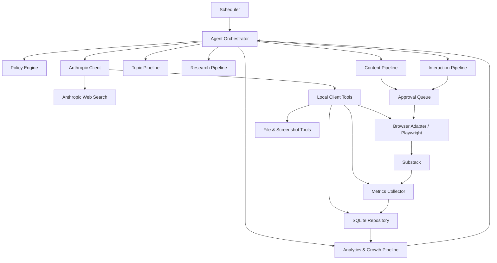

# 03 — ARCHITEKTURA AGENTA

## Cel pliku
Opis architektury: diagramy, moduły, warstwy, rola Anthropic API, Policy Engine, SQLite, Playwright, tryby pracy, poziomy autonomii i gotowość do migracji do chmury. **Każda większa zmiana architektury dopisywana z datą i wyjaśnieniem** (sekcja „Ewolucja architektury").

## Szablon wpisu ewolucji
```markdown
### [YYYY-MM-DD] Vx — <nazwa zmiany>
- **Co realnie działa po zmianie:**
- **Co się zmieniło względem poprzedniej wersji:**
- **Dlaczego (ADR):**
- **Diagram stanu faktycznego:**
```

---

## Najważniejsza decyzja architektoniczna
> **Claude = mózg, lokalne narzędzia = ręce, SQLite = pamięć, Policy Engine = deterministyczna bramka.**

Anthropic API odpowiada za osąd (dobór tematów, research, ocenę, pisanie, audyt, analizę). Lokalna aplikacja odpowiada za wykonanie (harmonogram, zapis, przeglądarka, screenshoty, limity, koszty, zatwierdzanie). **Model językowy nigdy nie steruje przeglądarką ani bazą bezpośrednio** — produkuje *propozycję akcji* (`ProposedAction`), Policy Engine ją waliduje, dopiero orchestrator wywołuje odpowiedni port.

## Diagram logiczny (docelowy)


## Warstwy
1. **Core** — konfiguracja (z `.env` + YAML, bez ścieżek absolutnych), typy/modele, zdarzenia, identyfikatory, zegar, budżet, obsługa błędów.
2. **Anthropic Layer** — jedyny silnik językowy i researchowy w MVP: `AnthropicClient`, `ModelRouter` (tani model do scoringu/Notes/komentarzy; mocny do artykułów/audytu/trudnego researchu — nazwy z `.env`), `UsageTracker`, (docelowo) `PromptRegistry`/`PromptCacheManager`.
3. **Orchestrator** — pętla runu, stan, retry, przechodzenie między etapami, respektowanie limitów; każdy run ma `run_id`, `account_id`, `workflow`, `status`, koszt, licznik interwencji człowieka.
4. **Policy Engine** — deterministyczna bramka: kill-switch, aktywność konta, budżet (miesięczny nadrzędny), progi scoringu, duplikaty, częstotliwość, wymóg akceptacji. Model nie może jej obejść.
5. **Local Tools za portami** — Browser (Playwright), Storage (SQLite), FileStore, SecretStore, Scheduler, Notification, ImageProvider (SVG→PNG), MetricsCollector.

## Moduły (workflows)
`topics` (discover/score/rank) · `research` (Research Card + weryfikacja źródeł) · `articles` (outline + draft + audyty fakt/styl/wzrost) · `notes` · `comments` (discovery/scoring/generacja) · `analytics` (metryki + raport tygodniowy) · `evidence` (zbieranie dowodów).

## Rola Anthropic API
Wszystko, co wymaga języka i osądu: planowanie, dobór i scoring tematów, research (server-side **web search** + web fetch), budowa Research Card, pisanie i audyt artykułów/Notes/komentarzy, analiza statystyk. Koszt web search liczony per request i wliczany do budżetu. Twarde reguły anty-halucynacyjne stoją **poza** modelem (w Policy/validation).

## Policy Engine
Zbudowany i przetestowany (walking skeleton). Obecnie pokrywa: kill-switch, aktywność konta, **budżet z priorytetem miesięcznym (ADR-012)**, progi scoringu tematu (artykuł ≥75, Note ≥65). Rozszerzenia (limity komentarzy, link ratio, częstotliwość) dojdą wraz z kolejnymi pipeline'ami. Kod: `app/policies/policy_engine.py` (fragment w `10_FRAGMENTY_KODU.md`).

## SQLite
Jedna baza z obowiązkowym scopingiem po `account_id` (ADR-006). Kod biznesowy nie dotyka SQL bezpośrednio — tylko przez repozytoria/`StoragePort`. Migracje wersjonowane: `0001_init` (schemat), `0002_topic_dedup` (deduplikacja), `0003_research_fields` (pola Research Card i źródeł). Kluczowe tabele: `accounts`, `account_policies`, `topics`, `research_cards`, `sources`, `content_items`, `interactions`, `approvals`, `metrics_daily`, `runs`, `model_usage`, `screenshots`.

## Playwright
Za `BrowserPort`. Osobny persistent context per konto w `data/browser-profiles/<account_id>/`. Logowanie **ręczne** (magic-link), bez auto-logowania i bez zapisu hasła. Screenshot po każdej akcji zewnętrznej. **W obecnym stanie: `DisabledBrowser` — port celowo wyłączony, zero akcji na Substacku.** Włączenie: Etap 4, najpierw tylko odczyt; publikacja tylko po jawnej zgodzie.

## Tryby pracy
- **FULL_PUBLICATION** — pełne prowadzenie (`nothing_is_accidental`).
- **COMMENT_ONLY** — tylko komentarze (konta owner/wife; nieaktywne w MVP).
- **DRAFT_ONLY** — tworzy propozycje, nic nie publikuje.
- **RESEARCH_ONLY** — tylko tematy/źródła/autorzy.

## Poziomy autonomii
> **Cel końcowy = LEVEL_3, nie LEVEL_1/2 (ADR-017).** Człowiek zatwierdza poziom autonomii i granice działania, nie każdą pojedynczą akcję. Pełna specyfikacja: `docs/archive/superseded_plans/IMPLEMENTATION_PLAN.md` CZĘŚĆ D.

LEVEL_0 (dry_run, tylko szkice, offline) → LEVEL_1 (kontrolowane realne testy, publikacja tylko za jawną, jednorazową zgodą — **etap przejściowy, dziś tu jesteśmy**, nie stan docelowy) → LEVEL_2 (pierwszy realny poziom autonomiczny: Notes/komentarze/odpowiedzi/lajki/subskrypcje/research/**artykuły** publikowane samodzielnie po przejściu scoringu, bez ręcznej akceptacji pojedynczej akcji) → LEVEL_3 (cel końcowy: pełna autonomia operacyjna — własny harmonogram, zarządzanie Topic Inventory, drobne zmiany strategii w twardych granicach; człowiek zachowuje kill switch, budżet, wgląd w logi, możliwość zatrzymania).

**Brak publicznego ujawnienia, że treść tworzy agent AI, jest niezmienny na każdym poziomie (ADR-018)** — konto działa jako anonimowa marka redakcyjna, bez fikcyjnej osoby/biografii, ale też bez etykiety „AI-generated". Autonomia dotyczy KTO zatwierdza wykonanie; informacja o AI zostaje wyłącznie w prywatnej dokumentacji, do osobnej decyzji właściciela o ujawnieniu.

## Gotowość do chmury
Sześć portów od początku: `SchedulerPort`, `StoragePort`, `BrowserPort`, `SecretStorePort`, `FileStorePort`, `NotificationPort`. Adaptery lokalne (APScheduler, SQLite, Playwright, `.env`, filesystem) wymienne na chmurowe (cloud scheduler, Postgres, kontener przeglądarki, secret manager, object storage) **bez zmiany logiki agenta**. Zakazy: ścieżki absolutne, zależność od konkretnego użytkownika Windows, logika biznesowa w UI, SQL poza repozytoriami, hasła w bazie.

---

## Ewolucja architektury (stan faktyczny, nie docelowy)

### [2026-07-11] V0 — Architektura na papierze
Istnieją dokumenty i configi, **zero kodu**. Punkt zerowy.

### [2026-07-11] V1 — Walking skeleton (Etap 0/1)
Realnie działa: konfiguracja (.env + YAML), SQLite (migracja 0001), `PolicyEngine` (kill-switch, aktywność, budżet, progi), `UsageTracker` (koszt → `model_usage` + `COSTS.csv`), `ModelRouter`, przepływ generacji+oceny tematów w `dry_run` z `FakeLLMClient`, CLI `run-topics`, 16 testów. Zmiana względem planu: dodano kolumnę `model_usage.dry_run` (odróżnia estymacje od realnych kosztów) — ADR-013; porty Scheduler/Browser jako świadome stuby (`DisabledBrowser`).

### [2026-07-11] V2 — Deduplikacja tematów + Research Pipeline (Etap 1A/1B)
Realnie działa: lokalna deduplikacja tematów (bez płatnego modelu; ADR-014), pełny research pipeline (plan → web search → źródła → Research Card → bramka jakości → SQLite → auto-docs) w `dry_run`, ochrona przed prompt injection (ADR-015), klienci `FakeResearchClient`/`AnthropicResearchClient` (testowalni bez sieci), 44 testy. Migracje 0002/0003.

### [2026-07-11] V2.1 — Pierwsze realne wywołanie Anthropic (Etap 1C)
Pierwszy kontakt z prawdziwym API: jedno, jawnie zatwierdzone, capnięte (0,30 USD) wywołanie dla tematu #2. Dotarło do modelu, użyło web search, ale JSON został ucięty — Research Card nie powstała (REJECT). Ujawniło i doprowadziło do naprawy buga: realny koszt nieudanego wywołania nie zapisywał się w bazie. **Rzeczywisty koszt (zweryfikowany później w konsoli Anthropic): 0,25 USD.** 47 testów.

### [2026-07-11] V3 — Dwuetapowy research + kalibrowany estymator kosztu (Etap 1D, ADR-016)
Zmiana architektoniczna wywołana incydentem V2.1: pesymistyczny szacunek kosztu PRZED wywołaniem (0,095 USD) okazał się **2,63× niższy** od realnego kosztu (0,25 USD, błąd ~+163%). Realnie działa: `app/research/cost_estimator.py` — koszt napędzany wyszukiwaniami skaluje się z ich liczbą (nie płaski bufor), wymagany margines bezpieczeństwa ≥50%. Research podzielony na dwa węższe wywołania: `gather_sources` (tylko web search + zbieranie źródeł/faktów, max 4 wyszukiwania) i `synthesize_card` (tylko analiza z już zebranych danych, zero web search) — z tanią bramką wczesnego wyjścia (za mało źródeł = STOP przed płatnym etapem 2). Stary jednoetapowy pipeline zachowany jako niezalecana opcja. 63 testy.

**Ważne zastrzeżenie architektoniczne** (wynikające z incydentu): limit kosztu (`--max-cost-usd`) **nigdy nie był** twardym hamulcem egzekwowanym W TRAKCIE pojedynczego zapytania do API — to kontrola PRZED startem, oparta na estymacji. Prawdziwą górną granicę per-wywołanie wyznaczają wyłącznie parametry przekazane do API (`max_tokens`, `max_uses`).

**Następna planowana wersja (nie zbudowana):** V4 — realne uruchomienie dwuetapowego pipeline'u (wymaga nowej, osobnej zgody właściciela), generator artykułów/Notes + panel FastAPI.

### [2026-07-11] Redefinicja stanu DOCELOWEGO (nie nowa wersja kodu — korekta celu)
Właściciel doprecyzował (ADR-017), że architektura docelowa to **LEVEL_3 — pełna autonomia operacyjna**, nie asystent wymagający ręcznej akceptacji każdej akcji na stałe. Poprzednie sformułowania („LEVEL_2 — docelowy sufit, artykuły/komentarze zawsze za akceptacją") opisywały fazę startową, nie cel. **Stan faktyczny kodu się nie zmienił** (wciąż V3 wyżej) — to korekta dokumentacji celu, nie nowa implementacja. Pełna specyfikacja: `docs/archive/superseded_plans/IMPLEMENTATION_PLAN.md` CZĘŚĆ D.

## Powiązania
- `ARCHITECTURE.md` (architektura docelowa, §4 zaktualizowane wg ADR-017)
- `docs/ARCHITECTURE_EVOLUTION.md` (źródło ewolucji), `docs/archive/superseded_plans/IMPLEMENTATION_PLAN.md` §B.1–B.6, CZĘŚĆ D
- `docs/DECISIONS.md` — ADR-006/011/012/013/014/015/016/017
- diagramy: `diagrams/` (do wyeksportowania)
